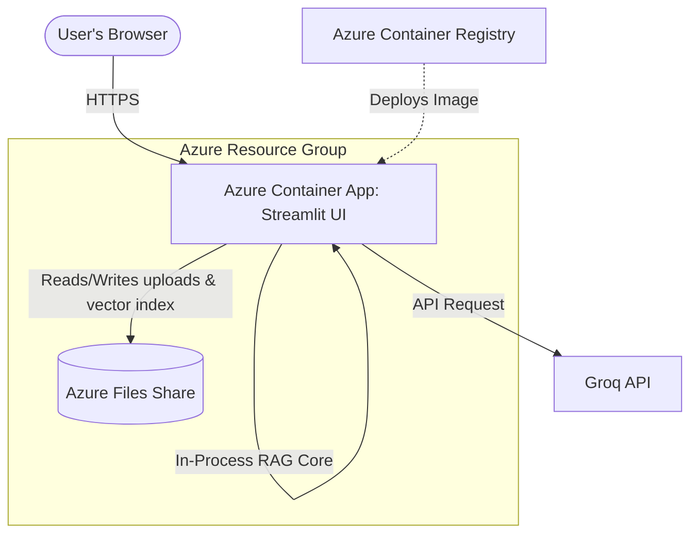

# Deploying RAG to Azure Cloud 🚀

Welcome to the Azure deployment guide! This folder contains step-by-step instructions to deploy your **Retrieval-Augmented Generation (RAG)** Q&A system to Microsoft Azure.

Because you are using the **Azure Free Tier**, these instructions are optimized to stay within the free limits while ensuring your application is fully functional, secure, and preserves data.

---

## 🏗️ Architecture Overview

For a RAG application, container hosting alone is not enough because the **FAISS vector database** and **uploaded documents** are stored locally on the disk. Standard container instances are **ephemeral** (their disk resets to the default image on every reboot or update).

To solve this, we use the following Azure services:

### 📦 Key Services Used

1. **Azure Container Registry (ACR)**: A private Docker registry in Azure to build and store your RAG Docker image.
2. **Azure Container Apps (ACA)**: A serverless container hosting platform with a generous **always-free tier** (180,000 vCPU-seconds and 360,000 GiB-seconds free per month).
3. **Azure Files (Azure Storage)**: A persistent SMB file share that we mount directly into the container under `/app/data`. This ensures that your vector store and document uploads are **never lost** when the container restarts.
4. **Groq API**: Your LLM provider (external, free tier).

---

## 🗺️ Step-by-Step Learning Path

We have broken down the deployment process into a structured workbook. Open the detailed guide below and follow it step-by-step.

> [!IMPORTANT] 📌
> You will perform all steps yourself in your local terminal. Do not run commands until you have read and understood them!

### 📖 \[Detailed Azure Deployment Guide (azure_rag_deployment.md)\](file:///c:/Users/sinha/OneDrive/Desktop/coding/cloud_azure/azure_rag_deployment.md)

This workbook will walk you through:

- **Step 1:** Installing Azure CLI and logging in.
- **Step 2:** Creating an Azure Resource Group (your container for resources).
- **Step 3:** Provisioning Azure Storage & creating an Azure Files Share.
- **Step 4:** Provisioning Azure Container Registry (ACR) and pushing your Docker image.
- **Step 5:** Deploying the container to Azure Container Apps with environment variables and persistent volume mounts.
- **Step 6:** Setting up environment variables and testing.
- **Step 7:** Monitoring and cleaning up to avoid unexpected charges.

---

## 💡 Azure Free Tier Best Practices

- **Use Resource Groups**: Keep all resources for this project inside a single resource group (e.g., `rg-rag-project`). If you ever want to stop and delete everything, you can delete this single resource group to guarantee you aren't charged.
- **Scale to Zero**: Azure Container Apps support scaling to zero replicas when idle. This means you only consume free-tier CPU-seconds when you are actively using the app!
- **Track your Credits**: Check the [Azure Portal Billing Section](https://portal.azure.com/#blade/Microsoft_Azure_Billing/SubscriptionsBlade) regularly to monitor your remaining $200 free credit.