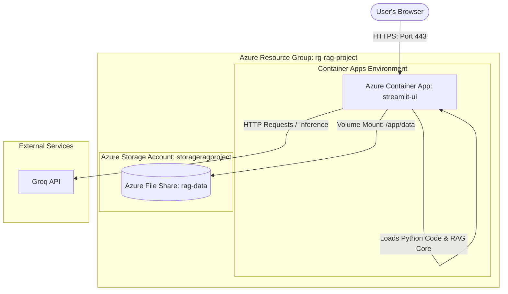

# Azure Cloud Deployment Guide: RAG Application ☁️

This workbook details the step-by-step process to deploy your RAG system on Microsoft Azure. By following this guide, you will learn how cloud deployment works, containerize your app, and set up persistent storage.

We will use **Azure Container Apps (ACA)** as the hosting platform. It is Docker-native, highly scalable, and has a generous **always-free tier** (unlike Azure App Service, where the free tier does not support Docker containers).

---

## 🏛️ Deployment Architecture

Before running commands, it's crucial to understand how the services connect. Here is the cloud architecture you are building:



---

## 🛠️ Step 0: Prerequisites

Ensure you have the following installed on your local Windows system:

1. **Git**: [Download Git](https://git-scm.com/downloads) (verify with `git --version`).
2. **Docker Desktop**: [Download Docker Desktop](https://www.docker.com/products/docker-desktop/) (must be running to build images).
3. **Azure CLI**: [Download Azure CLI for Windows](https://learn.microsoft.com/en-us/cli/azure/install-azure-cli-windows) (verify with `az --version` in PowerShell).
4. **Groq API Key**: Obtain a free key from the [Groq Console](https://console.groq.com/keys).

---

## 🏁 Step-by-Step Deployment Instructions

### Step 1: Log in to Azure and Set up Context

Open **PowerShell** as an administrator and run the following commands to authenticate.

```powershell
# 1. Log in to your Azure Account (this opens a browser window)
az login

# 2. List your subscriptions to verify your Free Trial is active
az account list --output table

# 3. If you have multiple subscriptions, set your active subscription (replace with your ID)
az account set --subscription "Your-Subscription-Name-Or-ID"
```

---

### Step 2: Create a Resource Group

An Azure Resource Group is a logical container where all your cloud resources are deployed.

```powershell
# Define variables for reuse
$RG_NAME="rg-rag-project"
$LOCATION="eastus"  # You can choose 'eastus', 'westeurope', 'centralus', etc.

# Create the resource group
az group create --name $RG_NAME --location $LOCATION
```

> [!NOTE] 💡
> Setting variables like $RG_NAME makes it easier to copy and paste subsequent commands.

---

### Step 3: Create a Storage Account & Persistent File Share

Containers are ephemeral: when they reboot, all uploaded files and FAISS vector databases disappear. To keep files permanently, we will create an **Azure File Share** and mount it to `/app/data` inside the container.

```powershell
# 1. Choose a unique name (numbers and lowercase letters only, 3-24 characters)
$STORAGE_ACCOUNT="storagerag$(Get-Random -Minimum 1000 -Maximum 9999)"
$SHARE_NAME="rag-data"

# 2. Create the Storage Account
az storage account create `
  --resource-group $RG_NAME `
  --name $STORAGE_ACCOUNT `
  --location $LOCATION `
  --sku Standard_LRS `
  --kind StorageV2

# 3. Retrieve the Storage Account Key (needed to create the file share)
$STORAGE_KEY=(az storage account keys list --resource-group $RG_NAME --account-name $STORAGE_ACCOUNT --query "[0].value" --output tsv)

# 4. Create the File Share inside the Storage Account
az storage share create `
  --name $SHARE_NAME `
  --account-name $STORAGE_ACCOUNT `
  --account-key $STORAGE_KEY
```

---

### Step 4: Provision Azure Container Registry (ACR) & Push Docker Image

ACR is a private registry in Azure where you upload your Docker image.

```powershell
# 1. Choose a unique registry name (alphanumeric only)
$ACR_NAME="reg-rag-project-$(Get-Random -Minimum 1000 -Maximum 9999)"

# 2. Create the registry
az acr create `
  --resource-group $RG_NAME `
  --name $ACR_NAME `
  --sku Basic

# 3. Log in to your new ACR registry through Docker
az acr login --name $ACR_NAME
```

Now, let's build and push the Docker image. Navigate to your local project directory `c:/Users/sinha/OneDrive/Desktop/coding/project/1` (using `cd` in your PowerShell window) and run:

```powershell
# 4. Build the Docker image locally
docker build -t "$($ACR_NAME).azurecr.io/rag-app:latest" .

# 5. Push the Docker image to your Azure Container Registry
docker push "$($ACR_NAME).azurecr.io/rag-app:latest"
```

---

### Step 5: Create the Azure Container Apps Environment

Before deploying our container, we need to create a **Container Apps Environment**. This acts as a security and networking boundary.

```powershell
# 1. Define environment name
$ENVIRONMENT_NAME="env-rag-project"

# 2. Register Container Apps provider extensions (if running for the first time)
az provider register --namespace Microsoft.App
az provider register --namespace Microsoft.OperationalInsights

# 3. Create the Environment
az containerapp env create `
  --name $ENVIRONMENT_NAME `
  --resource-group $RG_NAME `
  --location $LOCATION
```

---

### Step 6: Link Azure Storage to the Container Apps Environment

Now we must link the Azure File Share we created in **Step 3** to our Container Apps Environment so containers can access it.

```powershell
$STORAGE_LINK_NAME="rag-storage-link"

az containerapp env storage set `
  --name $ENVIRONMENT_NAME `
  --resource-group $RG_NAME `
  --storage-name $STORAGE_LINK_NAME `
  --account-name $STORAGE_ACCOUNT `
  --account-key $STORAGE_KEY `
  --share-name $SHARE_NAME `
  --access-mode ReadWrite
```

---

### Step 7: Deploy the Container App with Volume Mount and Secrets

Now we will create the container and configure it:

- Public ingress (port 8501) so you can access Streamlit.
- A Secret containing your `GROQ_API_KEY`.
- Mount the File Share to `/app/data` (which maps to your files, feedback, cache, and vector store).

To make deployment simple and avoid long, complex CLI flags, we will write a configuration template `containerapp.yaml` on your computer.

#### 📝 Action Item: Create a file named `containerapp.yaml` in your `cloud_azure` folder with the following content:

```yaml
type: Microsoft.App/containerApps
apiVersion: 2023-05-01
name: rag-qas-ui
resourceGroup: rg-rag-project
location: eastus   # Must match your RG location (e.g. eastus)
properties:
  environmentId: /subscriptions/YOUR_SUBSCRIPTION_ID/resourceGroups/rg-rag-project/providers/Microsoft.App/managedEnvironments/env-rag-project
  configuration:
    activeRevisionsMode: Single
    ingress:
      external: true
      targetPort: 8501
      transport: auto
      allowInsecure: false
    secrets:
      - name: groq-api-key
        value: "YOUR_GROQ_API_KEY"
  template:
    containers:
      - image: YOUR_ACR_NAME.azurecr.io/rag-app:latest
        name: rag-qas-ui
        env:
          - name: GROQ_API_KEY
            secretRef: groq-api-key
        volumeMounts:
          - volumeName: rag-volume
            mountPath: /app/data
    volumes:
      - name: rag-volume
        storageType: AzureFile
        storageName: rag-storage-link
```

> [!IMPORTANT] 📌
> Before deploying, open containerapp.yaml and replace: 1. YOURSUBSCRIPTIONID with your Azure Subscription ID (from Step 1). 2. YOURGROQAPIKEY with your actual Groq API Key. 3. YOURACR_NAME with the registry name generated in Step 4.

Once customized, deploy the file using:

```powershell
az containerapp create `
  --name rag-qas-ui `
  --resource-group $RG_NAME `
  --environment $ENVIRONMENT_NAME `
  --yaml c:/Users/sinha/OneDrive/Desktop/coding/cloud_azure/containerapp.yaml
```

---

## 🔍 Step 8: Verify and Test the Application

1. **Get the URL of your app**:

   ```powershell
   az containerapp show `
     --name rag-qas-ui `
     --resource-group $RG_NAME `
     --query "properties.configuration.ingress.fqdn" `
     --output tsv
   ```
2. **Access the Web Interface**: Copy the resulting URL (looks like `https://rag-qas-ui.xxxxxx.eastus.azurecontainerapps.io`) and open it in your web browser.
3. **Upload a document and ask a question**:
   - Go to the sidebar and upload a text file or PDF.
   - Click **Index uploaded files**.
   - Ask a question in the main panel.
   - *Verify Persistence*: Go to the Azure Portal, locate your Storage Account -&gt; File Shares -&gt; `rag-data`. You should see folders created for `uploads`, `vectorstore`, `cache`, and `feedback`!

---

## 🧹 Step 9: Clean Up Resources (Crucial!)

To avoid depleting your free credits when you aren't testing, you should clean up. Since we put everything in a single Resource Group, deletion is a single command:

```powershell
# Warning: This deletes EVERYTHING created in this guide. Use only when you are done!
az group delete --name rg-rag-project --yes --no-wait
```

---

## ❓ FAQ & Troubleshooting

### How do I check container logs if it fails to start?

If the app doesn't load, query the system logs using the Azure CLI:

```powershell
az containerapp logs show `
  --name rag-qas-ui `
  --resource-group $RG_NAME `
  --tail 100
```

### Can I build the container directly in the cloud?

Yes! If you don't want to run Docker locally, you can use **ACR Tasks** to build the image directly in Azure:

```powershell
az acr build --registry $ACR_NAME --image rag-app:latest c:/Users/sinha/OneDrive/Desktop/coding/project/1
```

This is extremely useful if Docker Desktop is slow or not installed on your system!