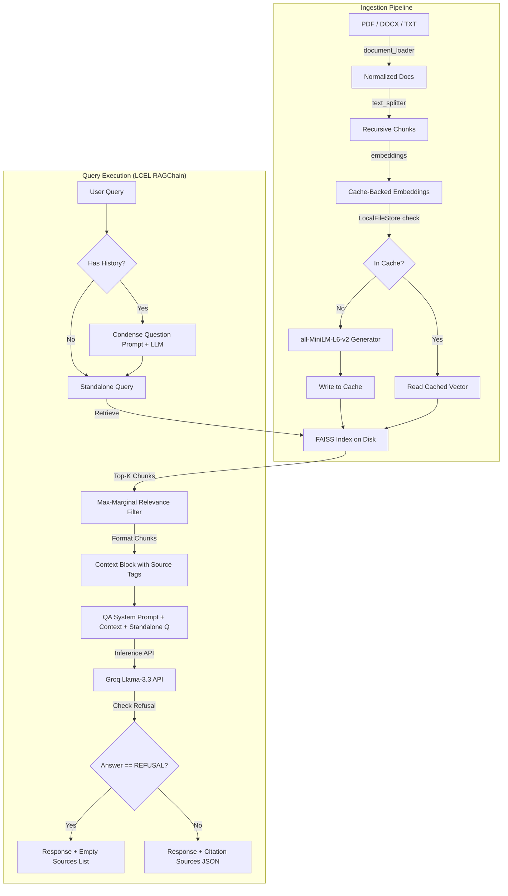

# Project 1: Retrieval-Augmented Generation (RAG) Q&A System
## Technical Questions & Answers

---

### Q1: Explain the end-to-end data flow and architecture of the RAG system.
#### Answer:
The system uses a decoupled frontend-backend architecture with a **Streamlit** user interface and a **FastAPI** REST API backend. The core RAG operations are executed using **LangChain (LCEL)**, **FAISS** as the vector database, and **Groq** for high-speed LLM inference.

##### Ingestion Flow:
1.  **Document Loading**: The system accepts `PDF`, `DOCX`, and `TXT` files via `document_loader.py`.
2.  **Chunking**: Raw documents are split into smaller segments using `RecursiveCharacterTextSplitter` with a default size of 1000 characters and an overlap of 150 characters.
3.  **Embedding Generation & Caching**: Chunks are embedded using HuggingFace's `all-MiniLM-L6-v2`. To prevent re-embedding identical text, `CacheBackedEmbeddings` is configured with `LocalFileStore` (`data/cache`).
4.  **Vector Storage**: The resulting vectors are stored in a persistent `FAISS` index on disk (`data/vectorstore`).

##### Inference Query Flow:
1.  **Query Condensation**: If a session ID is provided, the system retrieves past chat messages from in-memory memory (`memory.py`). It uses the LLM to rewrite the user's follow-up query + conversation history into a standalone query.
2.  **Retrieval**: The standalone query is embedded and searched against the `FAISS` index. It uses **MMR (Maximal Marginal Relevance)** search by default (retrieving `top_k=4` chunks) to maximize relevance while reducing redundancy.
3.  **Context Formatting**: Retrieved chunks are compiled into a formatted context block with bracketed metadata source labels (e.g., `[Document 1 | doc.pdf, p.2]`).
4.  **LLM Generation**: The system prompt (with strict anti-hallucination rules), the formatted context, the standalone query, and the message history are compiled into a prompt and sent to Groq's `llama-3.3-70b-versatile` model.
5.  **Refusal Inspection**: The backend checks if the output matches the pre-defined refusal response (`REFUSAL`). If true, it flags `is_unknown = True` and suppresses (hides) the source snippets before returning the response to the user.



---

### Q2: How does the system handle cases where the answer cannot be found in the provided context? Detail the anti-hallucination mechanism.
#### Answer:
To prevent hallucinations (where the LLM fabricates factual-sounding details not present in the context), the project implements a **two-layer anti-hallucination guardrail**:

1.  **System Prompt Enforcement**: The `QA_PROMPT` (defined in `src/prompts.py`) strictly instructs the model:
    > "If the context does not provide the answer, or if you are unsure, reply EXACTLY with: 'I don't have enough information in the provided documents to answer this question.' Do not try to make up an answer."
2.  **Post-Inference Code Filter**: In `src/rag_chain.py` inside the `RAGChain.ask()` method, the system evaluates the generated string response:
    ```python
    is_unknown = UNKNOWN_ANSWER.lower() in answer.lower()
    sources = [] if is_unknown else _docs_to_sources(retrieved)
    ```
    If the response contains the refusal string (`UNKNOWN_ANSWER`), it sets `is_unknown = True` and **completely wipes out the `sources` list**. This prevents the system from displaying misleading document snippets that did not actually help answer the query, protecting the integrity of the citations.

---

### Q3: What is the benefit of the embedding cache design in this project, and how is it implemented?
#### Answer:
In standard RAG pipelines, uploading and re-indexing the same documents multiple times causes duplicate embedding generation calls. This slows down performance and wastes API limits.

This project implements an **on-disk embedding cache** in `src/embeddings.py`:
*   **Implementation**: It wraps the HuggingFace `HuggingFaceEmbeddings` instance inside a LangChain `CacheBackedEmbeddings` object, using a `LocalFileStore` pointing to `data/cache`.
*   **Mechanism**: Before computing embeddings for a text chunk, the system calculates a hash of the text. If the hash exists in the `LocalFileStore`, the saved vector is read from disk. If missing, it computes the vector and writes it to the local cache.
*   **Benefit**: Re-indexing identical files or running tests repeatedly completes in milliseconds, bypassing CPU or GPU resources.

---

### Q4: Explain the question condensation step and why it is critical for conversational RAG.
#### Answer:
When a user asks follow-up questions in a chat interface (e.g., Q1: "Who is the CEO of Acme Corp?" followed by Q2: "When did he join?"), the second query contains pronouns ("he") that lack context.
If "When did he join?" is converted directly into vector embeddings, similarity search will fail because "he" does not map semantically to "CEO" or "Acme Corp" in the vector index.

##### Condensation Workflow:
1.  In `src/rag_chain.py`, when a request includes `session_id`, the system retrieves the conversational history.
2.  The raw follow-up query and history are compiled using the `CONDENSE_QUESTION_PROMPT`.
3.  The LLM generates a standalone, context-complete query, such as: "When did the CEO of Acme Corp join the company?"
4.  This standalone query is used to query the `FAISS` index, ensuring accurate chunk retrieval.
