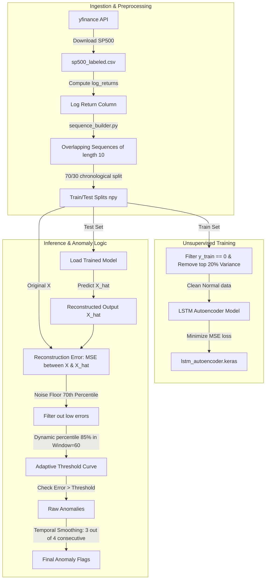

# Project 2: SentinelGuard – Anomaly Detection System
## Technical Questions & Answers

---

### Q1: Explain the overall system design and architecture of SentinelGuard.
#### Answer:
SentinelGuard is an unsupervised time-series anomaly detection system designed to identify abnormal market movements or trading signals. It is built using **TensorFlow/Keras** for Deep Learning, **Streamlit** for the visualization dashboard, and **Yahoo Finance (`yfinance`)** for ingestion.

##### Core Architecture Stages:
1.  **Data Ingestion**: Downloads historical S&P 500 stock prices (`yfinance`) and computes log-returns to build a stationary time-series.
2.  **Sequence Builder**: Converts the continuous series into overlapping fixed-size sequence windows (`SEQUENCE_LENGTH=10`) without shuffling, preserving chronological order.
3.  **Model Training**: Trains an LSTM (or GRU) Autoencoder *only* on normal, low-variance historical data. The autoencoder attempts to compress and reconstruct these sequences.
4.  **Reconstruction Error calculation**: Calculates Mean Squared Error (MSE) between original inputs ($X$) and reconstructed predictions ($\hat{X}$).
5.  **Dynamic Thresholding & Smoothing**: Suppresses low-level reconstruction noise, calculates a rolling-window percentile threshold, and applies temporal smoothing to determine final anomalies.
6.  **Dashboard Rendering**: Streamlit renders interactive price plots, reconstruction graphs, thresholds, and performance comparison tables.



---

### Q2: How does the training process prevent the Autoencoder from learning to reconstruct anomalous sequences?
#### Answer:
An Autoencoder identifies anomalies by learning to reconstruct "normal" baseline behavior. If anomalies are present in the training set, the network will learn to reconstruct them as well, causing low reconstruction errors on future anomalies (which would hide them).

To prevent this, `src/models/lstm_autoencoder.py` implements a **clean normal training filter** in `load_data()`:
```python
# 1. Filter out known anomalies (where label is 0)
normal_idx = np.where(y_train == 0)[0]
X_normal = X_train[normal_idx]

# 2. Variance filtering to remove high-volatility events
seq_var = np.var(X_normal, axis=(1, 2))
var_threshold = np.percentile(seq_var, 80)
X_clean = X_normal[seq_var < var_threshold]
```
This algorithm:
1.  Discards any sequence labeled as an anomaly in the raw dataset.
2.  Calculates the variance of each sequence.
3.  Establishes a threshold at the **80th percentile** of variance.
4.  Retains only the 80% cleanest, lowest-variance sequences for training.
This ensures the model only learns calm, standard market behaviors.

---

### Q3: Explain the layer configuration of the LSTM Autoencoder and the roles of `RepeatVector` and `TimeDistributed`.
#### Answer:
The LSTM Autoencoder in `lstm_autoencoder.py` is configured as follows:

```python
inputs = Input(shape=(SEQUENCE_LENGTH, N_FEATURES)) # Input: (10, 1)

# Encoder
x = LSTM(64, return_sequences=True)(inputs)
x = LSTM(32, return_sequences=False)(x)

# Bottleneck
encoded = Dense(16, activation="tanh")(x) # Latent Representation

# Decoder
x = RepeatVector(SEQUENCE_LENGTH)(encoded) # Replicates (16,) -> (10, 16)
x = LSTM(32, return_sequences=True)(x)
x = LSTM(64, return_sequences=True)(x)

outputs = TimeDistributed(Dense(N_FEATURES))(x) # Output: (10, 1)
```

##### Key Layers Explained:
*   **Encoder (`return_sequences=False` on final layer)**: Compresses the sequential timeline inputs $(10, 1)$ down into a flat, 1D feature vector of shape $(32,)$.
*   **Bottleneck (`Dense(16)`)**: Restricts the dimensionality further to a latent space representation of size 16.
*   **`RepeatVector(SEQUENCE_LENGTH)`**: Re-expands the flat bottleneck vector of shape $(16,)$ by duplicating it 10 times (yielding shape $(10, 16)$). This allows downstream recurrent decoder layers to receive a valid temporal sequence shape of length 10.
*   **`TimeDistributed(Dense(N_FEATURES))`**: Applies a dense weight layer to each time step independently. This projects the final decoder LSTM outputs $(10, 64)$ back to the original feature space $(10, 1)$, reconstructing the values at each point in time.

---

### Q4: Detail the anomaly detection post-processing logic (Noise Floor, Dynamic Thresholding, and Temporal Smoothing).
#### Answer:
Once reconstruction errors (MSE) are calculated, raw values are passed through three post-processing steps to filter out false positives:

1.  **Noise Floor Suppression**:
    ```python
    error_floor = np.percentile(errors, 70)
    errors = np.where(errors < error_floor, 0.0, errors)
    ```
    Sets the bottom 70% of reconstruction errors to exactly `0.0`. This removes small background noise fluctuations, leaving only significant errors active.
2.  **Dynamic Thresholding**:
    ```python
    def dynamic_threshold(errors, percentile=85, window=60):
        thresholds = np.zeros(len(errors))
        for i in range(len(errors)):
            start = max(0, i - window)
            thresholds[i] = np.percentile(errors[start:i + 1], percentile)
        return thresholds
    ```
    Instead of a single static line, this calculates the 85th percentile of errors in a rolling window of size 60. This adapts to varying baseline volatility levels.
3.  **Temporal Smoothing**:
    ```python
    for i in range(len(raw_preds)):
        start = max(0, i - MIN_CONSECUTIVE + 1)
        if raw_preds[start:i + 1].mean() >= 0.75:
            smoothed_preds[i] = 1
    ```
    To avoid flagging isolated, momentary spikes, the system requires **at least 75%** of the last 4 consecutive points (`0.75 * 4 = 3` points) to exceed the dynamic threshold before confirming a final anomaly.
