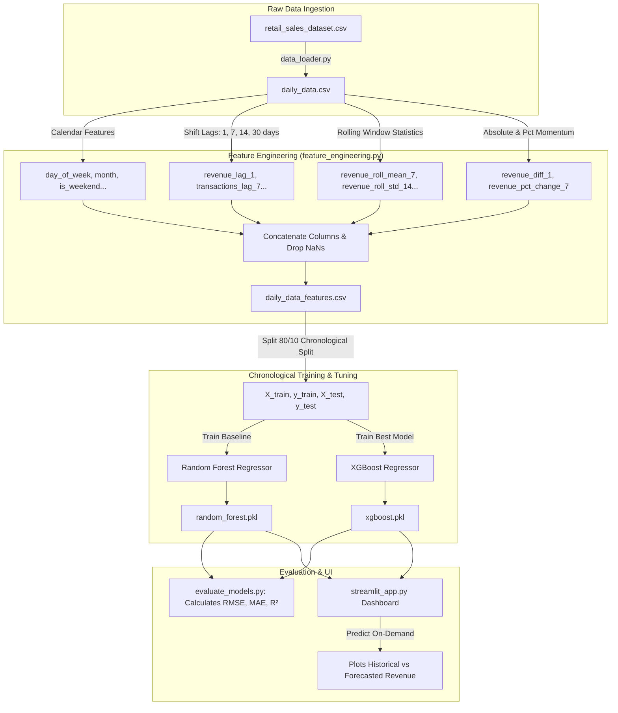

# Project 3: Retail Sales Forecasting
## Technical Questions & Answers

---

### Q1: Explain the overall execution pipeline and architecture of the Retail Sales Forecasting project.
#### Answer:
The Retail Sales Forecasting project builds an end-to-end Machine Learning pipeline designed to forecast daily store revenue. It is constructed in a modular, script-based flow using **Scikit-Learn**, **XGBoost**, and **Streamlit** for visualization.

##### Pipeline Workflow:
1.  **Data Loader (`data_loader.py`)**: Loads raw transaction logs (`retail_sales_dataset.csv`), aggregates sales data to a daily level, and outputs `daily_data.csv`.
2.  **Feature Engineering (`feature_engineering.py`)**: Adds chronological features, lag variables, rolling window aggregates, and momentum metrics, outputting `daily_data_features.csv`.
3.  **Time-Based Split (`train_ml_models.py`)**: Sorts data chronologically and splits it into 80% train and 20% test partitions. Crucially, it does not apply random shuffling, avoiding lookahead data leakage.
4.  **Model Training**: Trains a **Random Forest Regressor** (baseline) and an **XGBoost Regressor** (high performance) on the training partition. Models are saved as `.pkl` objects using `joblib`.
5.  **Model Evaluation (`evaluate_models.py`)**: Calculates predictive metrics (RMSE, MAE, and $R^2$ scores) on the test set.
6.  **Streamlit App (`streamlit_app.py`)**: Imports the saved models, computes predictions on user-selected date ranges, displays performance metrics, and automatically highlights the best model.



---

### Q2: Detail the feature engineering strategy used in `feature_engineering.py` and how it prevents data leakage.
#### Answer:
Time-series forecasting models cannot predict future dates using current features directly. Instead, they rely on historical lags, trend patterns, and variance indicators.

##### Engineered Features:
*   **Time/Calendar Features**: Extracts `day_of_week`, `week_of_year`, `month`, `quarter`, and a binary `is_weekend` flag to capture weekly and monthly cycles.
*   **Memory (Lag Features)**: Shifts historical metrics by 1, 7, 14, and 30 days (e.g., `df["daily_revenue"].shift(7)`). This allows the model to learn what sales were exactly 1 day, 1 week, 2 weeks, and 1 month ago.
*   **Rolling Statistics (Smoothing + Volatility)**: Calculates rolling means (smoothing out temporary noise) and rolling standard deviations (tracking volatility/variance shifts) across 7, 14, and 30-day windows.
*   **Trend & Momentum**: Calculates absolute revenue differences (`revenue_diff_1` and `revenue_diff_7`) and percentage differences (`revenue_pct_change_7`) to capture upward or downward sales momentum.

##### Preventing Data Leakage:
Data leakage occurs if future values are allowed to influence past predictions.
To prevent this, **all lag, rolling, and trend features are computed strictly on past values** using pandas `.shift()` and `.rolling()` methods.
Furthermore, the final dataset is sorted by date before splitting:
```python
df = df.sort_values("date").copy()
```
The train-test split splits the data sequentially:
```python
split_index = int(len(df) * split_ratio)
train_df = df.iloc[:split_index]
test_df = df.iloc[split_index:]
```
This ensures the model is trained only on past data and evaluated on subsequent future data, preventing lookahead bias.

---

### Q3: Why is standard K-Fold cross-validation avoided in this project? What strategy is used instead?
#### Answer:
In standard K-Fold cross-validation, the dataset is shuffled randomly and divided into $K$ folds.
For time-series data, this is problematic because:
1.  **Temporal Dependency Violation**: Shuffling destroys the chronological ordering of the records.
2.  **Lookahead Leakage**: Training folds would contain future data points, and the model would use future information to predict past validation targets, inflating accuracy estimates artificially.

##### Chronological Split Strategy:
Instead of shuffling, the project implements a **chronological split** (`time_series_split`):
*   Data is sorted by the `date` index.
*   The first 80% of dates are assigned to the training set.
*   The remaining 20% of newer dates are reserved for the test set.
This simulates a real production setting: the model learns from historical patterns and is evaluated on subsequent future data.

---

### Q4: Compare the performance of the Random Forest and XGBoost models. How do you interpret the $R^2$ score?
#### Answer:
Both models are ensemble methods, but they utilize different approaches:
*   **Random Forest Regressor**: Uses **Bagging** (Bootstrap Aggregating). It builds multiple independent decision trees in parallel and averages their predictions. It is robust to overfitting.
*   **XGBoost Regressor**: Uses **Boosting**. It trains decision trees sequentially, with each new tree attempting to predict and correct the residuals (errors) of the preceding trees.

##### Performance Comparison:
*   **Random Forest**: RMSE = 279.53, MAE = 175.40, $R^2 = 0.909$
*   **XGBoost**: RMSE = 240.12, MAE = 153.10, $R^2 = 0.933$
XGBoost performed better, lowering both absolute error (MAE) and squared error (RMSE).

##### Interpreting the $R^2$ Score ($0.933$):
The Coefficient of Determination ($R^2$) is $0.933$. This indicates that **$93.3\%$ of the variance in daily retail revenue is explained by the features** in our model (lags, rolling averages, and calendar features). Only $6.7\%$ of the variance remains unexplained (attributable to random noise or unmeasured variables).
This represents a highly accurate model suitable for sales planning and inventory optimization.
