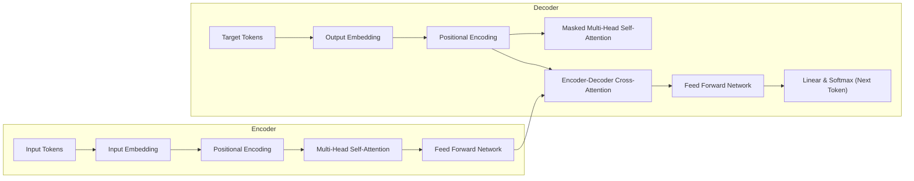

# Generative AI, RAG & LLM: Comprehensive Theory Study Guide

---

## Module 1: Generative AI Basics

### 1. Fundamentals
*   **What is Generative AI?**
    Generative AI (GenAI) is a branch of Artificial Intelligence focused on models that can generate new content—including text, images, code, synthetic data, and audio—by learning the underlying probability distributions of training datasets.
*   **How does Generative AI work?**
    It uses deep neural networks (primarily Transformers and Diffusion models) trained on massive datasets. The models learn the relationships between data components and predict the next logical token, pixel, or audio frame based on input prompts.
*   **Applications of Generative AI**
    *   **Content Generation**: Writing marketing copy, emails, articles, and generating creative artwork.
    *   **Code Synthesis**: Autocompleting or writing source code (GitHub Copilot).
    *   **Conversational Agents**: Customer support bots and personal assistants.
    *   **Data Augmentation**: Generating synthetic data to train other ML models.
    *   **Summarization**: Condensing long articles, transcripts, or financial reports.
*   **Advantages of Generative AI**
    *   Increases human productivity and speeds up drafting tasks.
    *   Enables personalized interactions at global scale.
    *   Accelerates prototyping in software engineering and research.
*   **Limitations of Generative AI**
    *   **Hallucinations**: Generates incorrect or fabricated facts with high confidence.
    *   **Compute Costs**: Requires heavy GPU resources to train and run inference.
    *   **Data Privacy**: Risks leaking proprietary training data during model outputs.
    *   **Ethical Concerns**: Can be used to create deepfakes and spread disinformation.
*   **AI vs ML vs DL vs Generative AI**
    *   **AI**: Broad discipline of machines simulating human intelligence.
    *   **ML**: Subset of AI using statistical algorithms to make predictions.
    *   **DL**: Subset of ML utilizing multi-layered neural networks.
    *   **Generative AI**: Subset of DL focused on creating new, original content rather than classifying or predicting existing values.
*   **Discriminative AI vs Generative AI**
    *   **Discriminative AI**: Learns decision boundaries to predict a label given inputs: $P(y|x)$. (e.g. classifying an email as Spam/Not Spam).
    *   **Generative AI**: Models the underlying data distribution to generate new instances: $P(x)$ or $P(x|y)$. (e.g. writing a new email).
*   **Foundation Models**
    Large-scale models (like GPT-4 or LLaMA) trained on massive, broad data at scale. They act as a foundational starting point that can be fine-tuned or prompted for a wide variety of downstream tasks.
*   **Generative AI Workflow**
    ```
    [Define Goal] -> [Select Foundation Model] -> [Prompt Design / RAG] -> [Evaluation] -> [Optimization (Fine-tuning)] -> [Deployment] -> [Monitoring]
    ```
*   **Challenges in Generative AI**
    *   **Alignment**: Ensuring models act in accordance with human values and intentions.
    *   **Jailbreaking**: Users hacking prompt filters to generate harmful content.
    *   **Inference Latency**: Generating tokens takes significant computational time.

---

## Module 2: Large Language Models (LLMs)

*   **What is an LLM?**
    A Large Language Model is a Transformer-based neural network containing billions of parameters, trained on massive web-scale text corpora to understand and generate human language.
*   **How does an LLM work?**
    It operates autoregressively: given a sequence of input tokens (prompt), it calculates a probability distribution over its vocabulary to predict and generate the next token, appending it to the input sequence for the subsequent step.
*   **Leading LLM Models**
    *   **GPT (OpenAI)**: Closed-source, high-capability models (e.g., GPT-4o).
    *   **BERT (Google)**: Early Encoder-only model optimized for search and classification.
    *   **T5 (Google)**: Text-to-Text Transfer Transformer (Encoder-Decoder framework).
    *   **LLaMA (Meta)**: Highly performant open-weights model series.
    *   **Mistral (Mistral AI)**: Highly efficient open-weights models utilizing Mixture-of-Experts (MoE).
    *   **Gemma (Google)**: Lightweight open-weights model family.
    *   **Claude (Anthropic)**: Closed-source models aligned for safety and high context reasoning.
    *   **DeepSeek**: High-performance, budget-efficient Mixture-of-Experts models.
    *   **Phi Models (Microsoft)**: Small Language Models (SLMs) trained on highly curated synthetic textbook-quality data.
*   **Open-source vs Closed-source LLMs**
    *   **Open-source (e.g., LLaMA, Mistral)**: High control, self-hosted, guarantees data privacy, customizable weights, but requires infrastructure maintenance.
    *   **Closed-source (e.g., Claude, GPT-4)**: State-of-the-art capability, zero infrastructure overhead, accessible via simple APIs, but presents data privacy concerns and vendor lock-in risks.
*   **Model Families**
    *   **Decoder-only**: Autoregressive next-token prediction, best for text generation (e.g., GPT, LLaMA).
    *   **Encoder-only**: Bidirectional context analysis, best for classification and embeddings (e.g., BERT).
    *   **Encoder-Decoder**: Translates input sequence to output sequence, best for translation and summarization (e.g., T5).

---

## Module 3: Transformers

The architecture introduced in the landmark paper **"Attention Is All You Need"** (2017) that forms the foundation of all modern LLMs.

### 1. Transformer Architecture


### 2. Core Concepts
*   **Why Transformers replaced RNNs?**
    RNNs process tokens sequentially, which prevents training parallelization. Transformers process all tokens in parallel, enabling training on massive datasets. They also avoid vanishing gradients over long context spans.
*   **Encoder vs Decoder**
    The Encoder processes the input sequence bidirectionally to build context representations. The Decoder generates output tokens autoregressively (one-by-one) while looking at the Encoder's representations.
*   **Self-Attention**
    Calculates relationships between all tokens in a sequence. Uses **Query ($Q$)**, **Key ($K$)**, and **Value ($V$)** vectors:
    $$\text{Attention}(Q, K, V) = \text{softmax}\left(\frac{QK^T}{\sqrt{d_k}}\right)V$$
*   **Multi-Head Attention**: Runs multiple self-attention heads in parallel, allowing the model to focus on different subspaces of representation (e.g., matching verbs with nouns, resolving pronouns).
*   **Positional Encoding**: Sinusoidal mathematical values added to input embeddings to inject word order information, since Transformers process all tokens simultaneously.
*   **Layer Normalization & Residual Connections**: Standardizes inputs to each layer and uses skip connections ($F(x) + x$) to maintain gradient stability in deep networks.

---

## Module 4: Tokens & Tokenization

*   **What is a Token?**
    The basic building block processed by an LLM. It can be a whole word, a sub-word, or a single character. On average, 100 tokens equal approximately 75 English words.
*   **Tokenization**
    The process of splitting raw text into integers (Token IDs) matching the model's vocabulary list.
*   **Algorithms**
    *   **BPE (Byte Pair Encoding)**: Iteratively merges the most frequent character pairs. Used by GPT models.
    *   **WordPiece**: Merges character pairs based on likelihood maximization. Used by BERT.
    *   **SentencePiece**: Treats text as a raw input stream including spaces, making it language-independent.
*   **Token Limitations & Cost**
    *   **Context Window**: The maximum limit of tokens a model can process in a single call.
    *   **Prompt Tokens**: Input tokens sent to the LLM.
    *   **Completion Tokens**: Output tokens generated by the LLM.
    *   **Token Cost**: API pricing is calculated based on prompt and completion token counts (typically priced per 1 Million tokens).

---

## Module 5: Embeddings

*   **What are Embeddings?**
    High-dimensional numerical vector representations of text that capture semantic meaning. Text strings with similar meanings are placed close together in the vector space.
*   **Why Embeddings?**
    They translate human text into coordinate geometry, allowing computers to perform mathematical operations (like searching for similar concepts).
*   **Similarity Search Metrics**
    *   **Cosine Similarity**: Measures the cosine of the angle between two vectors, returning a value between $-1$ and $1$. Ignores magnitude:
        $$\text{Cosine Similarity} = \frac{\mathbf{A} \cdot \mathbf{B}}{\|\mathbf{A}\| \|\mathbf{B}\|}$$
    *   **Euclidean Distance**: Measures the straight-line distance between two points. Smaller values indicate higher similarity.
    *   **Dot Product Similarity**: Measures projection of vector A onto B, taking both direction and magnitude into account.

---

## Module 6: Prompt Engineering

*   **What is Prompt Engineering?**
    The practice of structuring and optimizing input text prompts to guide LLMs to produce accurate, structured, and contextual outputs.
*   **Techniques**
    *   **Zero-shot Prompting**: Asking the model to perform a task without providing any examples.
    *   **One-shot / Few-shot Prompting**: Providing one or multiple input-output examples before the final query to define style or formatting.
    *   **Chain of Thought (CoT)**: Instructing the model to write out its step-by-step reasoning (e.g., "Think step-by-step") before outputting the final answer, improving logical accuracy.
    *   **Tree of Thought (ToT)**: An advanced technique where the model explores, evaluates, and branches multiple reasoning paths, backtracking if a path fails.
    *   **Self-Consistency**: Generating multiple reasoning paths and choosing the final answer via majority vote.
    *   **Role Prompting**: Defining a persona for the model (e.g., "Act as a Senior QA Analyst").
    *   **Structured Prompting**: Requesting the model output data in a structured format like JSON or markdown.
*   **Prompt Types**
    *   **System Prompt**: High-level instructions defining rules, tone, safety guardrails, and context boundaries.
    *   **User Prompt**: The actual question or input text provided by the user.
    *   **Assistant Prompt**: The historical or auto-completed response generated by the model.

---

## Module 7: LLM Parameters

Parameters used during API inference to control output generation:

*   **Temperature**: Controls randomness. Range is $(0, 2)$.
    *   *Low temperature (e.g., 0)*: Deterministic, factual, and consistent (best for code generation).
    *   *High temperature (e.g., 0.8+)*: Diverse and creative (best for brainstorming).
*   **Top-k Sampling**: Limits the next token selection to the $k$ most likely tokens.
*   **Top-p (Nucleus) Sampling**: Limits selection to the smallest set of tokens whose cumulative probability exceeds the threshold $p$ (e.g., $p=0.9$).
*   **Max Tokens**: The maximum limit of tokens allowed in the generated output.
*   **Stop Sequences**: Specified characters or phrases that immediately halt generation when encountered.
*   **Frequency Penalty**: Penalizes tokens based on how many times they have already appeared in the output, reducing repetitive loops.
*   **Presence Penalty**: Penalizes tokens based on whether they have appeared at all in the output, encouraging the model to introduce new topics.
*   **Seed**: Sets a static random state to ensure deterministic, reproducible outputs.

---

## Module 8: Retrieval-Augmented Generation (RAG)

*   **What is RAG?**
    An architectural pattern that enhances LLM responses by retrieving relevant information from an external knowledge base (e.g. documents, database) and injecting it into the prompt context before generating the final answer.
*   **Why RAG?**
    *   **Reduces Hallucinations**: Grounds predictions in facts.
    *   **Dynamic Data Access**: Allows querying private databases or real-time info without retraining models.
    *   **Citations**: Enables tracing responses back to source chunks.
*   **RAG Architectures**
    *   **Naive RAG**: Simple retrieve-then-generate workflow.
    *   **Advanced RAG**: Adds pre-retrieval optimization (query expansion/rewriting) and post-retrieval optimization (re-ranking retrieved chunks).
    *   **Hybrid RAG**: Combines keyword search (BM25) with semantic vector search.
    *   **Adaptive RAG**: Agents dynamically route queries to different search engines or answer databases based on query difficulty.
    *   **Agentic RAG**: Autonomous agents evaluate the relevance of retrieved documents, rewrite query goals, and search iteratively until they gather enough context to generate an answer.

---

## Module 9: RAG Components

*   **Document Loaders**: Extract text from various formats (e.g. PyPDF, Unstructured, Web scraping).
*   **Chunking**
    Dividing long documents into smaller segments to fit within the context window and maintain semantic focus.
    *   **Chunk Size**: The maximum number of tokens or characters per chunk.
    *   **Chunk Overlap**: The number of shared characters between adjacent chunks.
        > [!NOTE]
        > Chunk overlap keeps semantic context intact across boundaries, preventing split sentences from losing their meaning.
*   **Splitter Types**
    *   *Recursive Character Text Splitter*: Splits recursively on a list of separators (paragraphs, sentences, words) to keep paragraphs together.
    *   *Semantic Chunking*: Splits text based on changes in embedding distances between consecutive sentences.
*   **Metadata**: Tags attached to chunks (e.g., source file, page number) to allow post-retrieval filtering.

---

## Module 10: Vector Databases

Specialized databases designed to index, store, and query high-dimensional vector embeddings efficiently.

*   **FAISS (Facebook AI Similarity Search)**: A lightweight, open-source local library developed by Meta for fast vector clustering and similarity searches.
*   **ChromaDB**: An easy-to-use open-source embedded vector database designed for local development.
*   **Pinecone**: A fully managed cloud-native vector database.
*   **Weaviate / Milvus / Qdrant**: Scale-out vector databases optimized for production deployments.
*   **LanceDB**: Serverless, disk-based vector database optimized for multi-modal data.
*   **Integrations**: Relational and search systems supporting vector indexing (e.g., `pgvector` for PostgreSQL, Elasticsearch Vector Search).

---

## Module 11: Retrieval Techniques

*   **Similarity Search**: Finds the closest vectors using cosine similarity or Euclidean distance.
*   **MMR Search (Maximal Marginal Relevance)**: Optimizes for both query relevance and document diversity, reducing redundancy in the retrieved context.
*   **Hybrid Search**: Combines **Sparse Retrieval** (BM25 keyword matching) with **Dense Retrieval** (vector semantic search).
*   **Re-ranking**
    Uses a deep **Cross-Encoder** model to re-score the top retrieved candidate chunks, filtering out irrelevant chunks before passing them to the LLM:
    ```
    [Query] -> [Vector Search (Top 50 Chunks)] -> [Cross-Encoder Re-ranker] -> [Top 5 Chunks] -> [LLM]
    ```
*   **Reciprocal Rank Fusion (RRF)**: An algorithm that combines the rank lists from keyword and vector searches to produce a unified, optimal rank list.

---

## Module 12: LangChain

An open-source orchestration framework designed to simplify building LLM applications.

*   **LCEL (LangChain Expression Language)**: A declarative way to chain LangChain components together using the pipe operator (`|`):
    ```python
    chain = prompt_template | llm | output_parser
    ```
*   **Key Components**
    *   **Runnable**: The base protocol that standardizes invoke, stream, and batch calls.
    *   **Chains**: Links multiple LLM steps together (e.g., Sequential Chain, Router Chain).
    *   **Memory**: Persists conversational history across chat turns (e.g. `ConversationBufferMemory`).
    *   **Callbacks**: Hooks for logging, tracing, and monitoring execution chains.
    *   **Agents**: Chains where the LLM dynamically decides which tools to call.

---

## Module 13: AI Agents

*   **What is an AI Agent?**
    An autonomous program powered by an LLM that can use tools, plan execution steps, and make decisions to achieve a goal.
*   **ReAct Framework (Reasoning + Acting)**
    A prompt pattern combining reasoning steps (Thought) and actions (Action $\to$ Tool call $\to$ Observation) iteratively to solve problems:
    ```
    Thought: I need to search the weather in Tokyo.
    Action: weather_tool("Tokyo")
    Observation: 25°C, Sunny.
    Thought: I can now answer the user.
    ```
*   **Function / Tool Calling**: The LLM outputs a structured JSON object containing function arguments, which the system executes locally.
*   **Agent Behaviors**: Planning (breaking down goals) and Reflection (self-correcting outputs).
*   **Multi-Agent Frameworks**
    *   **CrewAI**: Role-playing agents working in structured pipelines.
    *   **LangGraph**: Stateful, cyclic graph orchestration for building multi-agent systems.
    *   **AutoGen**: Conversational multi-agent framework developed by Microsoft.

---

## Module 14: Model Context Protocol (MCP)

*   **What is MCP?**
    An open standard protocol developed by Anthropic that defines how LLM clients securely connect to external servers providing contexts, resources, and tools.
*   **Why MCP?**
    *   **Standardization**: Replaces unique API integration code with a single protocol, allowing any client to connect to any server.
    *   **Context Integration**: Simplifies connecting LLMs to databases, file systems, and tools.
*   **Architecture Components**
    *   **MCP Client**: The LLM host application (e.g. Claude Desktop).
    *   **MCP Server**: A service exposing tools (executable functions) and resources (read-only data sources).
    *   **MCP vs. REST API**: REST is a general web API. MCP is structured specifically for LLMs, handling prompt templates, tool descriptions, and resource contexts natively over JSON-RPC.

---

## Module 15: Fine-Tuning

*   **What is Fine-Tuning?**
    The process of training a pre-trained model on a custom dataset, updating its weights to specialize in a task, style, or domain.
*   **Methodologies**
    *   **Full Fine-Tuning**: Updates all model weights. Highly resource-intensive.
    *   **PEFT (Parameter-Efficient Fine-Tuning)**: Updates only a small subset of parameters.
    *   **LoRA (Low-Rank Adaptation)**: Freezes base weights and injects small rank-decomposition matrices into attention layers, reducing trainable parameters by 99%.
    *   **QLoRA (Quantized LoRA)**: Applies LoRA to a base model quantized to 4-bit precision, saving significant GPU memory.
    *   **RLHF (Reinforcement Learning from Human Feedback)**: Aligns models with human preferences using reward models.
    *   **DPO (Direct Preference Optimization)**: Directly updates model weights based on preference pairs without training a separate reward model, reducing training complexity.

---

## Module 16: Model Deployment

*   **vLLM**: High-throughput LLM serving engine using **PagedAttention** to optimize GPU memory usage.
*   **Ollama**: A tool for running and packaging open-weights models locally.
*   **TGI (Text Generation Inference)**: Hugging Face's production-grade LLM serving framework.
*   **GGUF Models**: An optimized binary format designed for fast local/CPU inference, supporting quantization.
*   **Quantization**: Reducing precision (e.g. FP16 $\to$ INT4) to decrease model size and memory requirements.

---

## Module 17: Hallucination & Safety

*   **Hallucination**: When an LLM confidently generates incorrect or fabricated facts not grounded in training data or prompt context.
    *   *Reduction Strategies*: Grounding responses using RAG, lowering temperature to 0, and using validation guardrails.
*   **Safety Concepts**
    *   **Guardrails**: Middleware that inspects and filters user inputs and model outputs (e.g., NeMo Guardrails).
    *   **Prompt Injection**: Bypassing system prompts by embedding malicious instructions in user inputs.
    *   **Jailbreak Attacks**: Hacking model safety boundaries using role-play or hypothetical scenarios.
    *   **PII Protection**: Masking Personally Identifiable Information before sending it to the model.

---

## Module 18: LLM Evaluation

*   **BLEU / ROUGE**: Evaluates n-gram overlap between generated and reference text. Used for translation (BLEU) and summarization (ROUGE).
*   **BERTScore**: Computes semantic similarity between text tokens using contextual embeddings.
*   **RAGAS Framework**: Evaluates RAG systems using specific metrics:
    *   *Faithfulness*: Is the answer grounded in the retrieved context?
    *   *Answer Relevance*: Does the response address the user's question?
    *   *Context Recall*: Did the retriever fetch all necessary information?
*   **Performance Metrics**: Latency (Time to First Token) and Throughput (Tokens per second).

---

## Module 19: Production GenAI

*   **Caching**
    *   **Prompt Caching**: Caches static system prompts to avoid re-processing tokens.
    *   **Response Caching**: Caches semantic queries to serve cached replies to identical questions instantly.
*   **Streaming**: Returning generated tokens chunk-by-chunk using Server-Sent Events (SSE) to reduce perceived latency.
*   **Operations**: Async inference, Load balancing, Autoscaling, and observability tracing (e.g., using LangSmith).

---

## Module 20: GenAI Project Questions (RAG System)

*   **Explain your RAG project architecture.**
    Built an internal QA assistant using a PDF document parser, ChromaDB for vector storage, LangChain for orchestration, and FastAPI for API serving.
*   **Why did you choose FAISS?**
    FAISS is lightweight and allows in-memory vector indexing locally, eliminating database hosting costs for small-scale datasets.
*   **Why chunking and embeddings?**
    Chunking is required because documents exceed context windows. Embeddings convert text chunks into vectors, enabling semantic similarity search.
*   **How did you reduce hallucinations?**
    Used RAG to ground the prompt context, set temperature to 0, forced the model to cite source chunks, and used guardrail checkers to flag outputs.
*   **How do you update the knowledge base?**
    Implemented an event-driven pipeline that triggers on file uploads, processes updates, chunks data, generates embeddings, and performs upserts into the vector database.
*   **How do you scale the application?**
    Migrate ChromaDB/FAISS to a managed cloud vector database (Pinecone/Milvus), use vLLM with autoscaling GPU nodes for model serving, and implement semantic prompt caching.

---

## ⭐ Top 50 Most Frequently Asked GenAI Questions (Accenture)

1.  **What is Generative AI?**
    An AI branch focused on generating new content based on patterns learned from training data.
2.  **AI vs ML vs DL vs GenAI?**
    AI is broad intelligence simulation; ML learns patterns; DL uses deep neural networks; GenAI generates new content.
3.  **What is an LLM?**
    Large Language Model: A Transformer-based model containing billions of parameters trained on web-scale text.
4.  **Describe the Transformer Architecture.**
    An attention-based model containing an Encoder (bidirectional context) and a Decoder (autoregressive generation), discarding recurrent loops.
5.  **What is Self-Attention?**
    A mechanism that calculates relationships between all tokens in a sequence using Query, Key, and Value vectors.
6.  **What is Tokenization?**
    The process of splitting text into sub-word tokens and mapping them to integer IDs.
7.  **What are Embeddings?**
    High-dimensional vector representations of text capturing semantic meaning.
8.  **What is a Vector Database?**
    A database optimized for storing, indexing, and performing fast similarity searches on vector embeddings.
9.  **FAISS vs ChromaDB vs Pinecone?**
    *   **FAISS**: Local in-memory similarity library.
    *   **ChromaDB**: Embedded open-source developer vector database.
    *   **Pinecone**: Fully managed cloud-native vector database.
10. **What is RAG?**
    Retrieval-Augmented Generation: Retrieving external facts and injecting them into the LLM prompt context to improve outputs.
11. **Explain Naive vs Advanced RAG.**
    Naive RAG does simple retrieve-then-generate. Advanced RAG adds pre-retrieval optimization (query expansion) and post-retrieval re-ranking.
12. **Why Chunking?**
    To fit documents into context windows and maintain semantic focus.
13. **Chunk Size vs Chunk Overlap?**
    Chunk Size is the length of each segment. Chunk Overlap is the count of shared tokens between adjacent chunks, preserving context at splits.
14. **What is a Retriever?**
    A component that queries a vector database to fetch the most similar chunks based on user query embeddings.
15. **Similarity vs MMR Search?**
    Similarity search returns the closest vectors. MMR (Maximal Marginal Relevance) search returns relevant but diverse vectors, reducing redundancy.
16. **What is LangChain?**
    An open-source orchestration framework designed to simplify building LLM applications.
17. **What is LCEL?**
    LangChain Expression Language: A declarative syntax for chaining components using the pipe operator (`|`).
18. **What is a PromptTemplate?**
    A parameterized string template used to dynamically inject variables into LLM prompts.
19. **What is Memory in LangChain?**
    A mechanism that stores and injects conversation history across chat turns.
20. **What is an AI Agent?**
    An autonomous program powered by an LLM that can use tools and plan steps to achieve a goal.
21. **What is the ReAct Framework?**
    An iterative agent loop combining reasoning steps (Thought) and actions (Action/Observation).
22. **What is the Model Context Protocol (MCP)?**
    An open standard protocol that defines how LLMs securely connect to external tools, databases, and context servers.
23. **What is Function Calling?**
    When an LLM outputs structured JSON containing function arguments to execute local code or APIs.
24. **What is Prompt Engineering?**
    Optimizing input prompts to guide an LLM's output.
25. **Zero-shot vs Few-shot Prompting?**
    Zero-shot provides no examples. Few-shot provides input-output examples before the final query.
26. **What is Chain of Thought?**
    Prompting the model to write out its step-by-step reasoning process, improving logical accuracy.
27. **What is Temperature?**
    A parameter controlling the randomness of next-token selection. Low: deterministic; High: creative.
28. **Top-k vs Top-p?**
    Top-k selects from the $k$ most likely tokens. Top-p selects from the smallest set of tokens whose cumulative probability exceeds $p$.
29. **What is Hallucination?**
    When an LLM generates incorrect or fabricated facts not grounded in context.
30. **What are Guardrails?**
    Middleware that filters user inputs and model outputs against safety policies.
31. **What is Fine-Tuning?**
    Training a pre-trained model on a custom dataset, updating its weights to specialize in a task.
32. **What is PEFT?**
    Parameter-Efficient Fine-Tuning: Modifying only a small subset of parameters to reduce resource requirements.
33. **LoRA vs QLoRA?**
    LoRA injects small trainable rank-decomposition matrices into attention layers. QLoRA applies LoRA to a base model quantized to 4-bit precision.
34. **What is RLHF?**
    Reinforcement Learning from Human Feedback: Aligning models with human preferences using reward models.
35. **What is DPO?**
    Direct Preference Optimization: Directly optimizing model weights on preference pairs, avoiding reward model training.
36. **Ollama vs vLLM?**
    Ollama is optimized for running models locally. vLLM is an enterprise serving engine using PagedAttention to optimize throughput.
37. **What is Model Quantization?**
    Reducing weight precision (e.g. FP16 $\to$ INT4) to decrease model size and memory requirements.
38. **What is GGUF?**
    An optimized binary format designed for fast local/CPU inference, supporting quantization.
39. **How do you evaluate a RAG system?**
    Using frameworks like RAGAS to measure faithfulness, answer relevance, context recall, and context precision.
40. **What is Prompt Injection?**
    An attack where user inputs contain instructions that override the system prompt guidelines.
41. **What are Embeddings Models?**
    Models (e.g., SentenceTransformers) that convert text into dense, high-dimensional semantic vector spaces.
42. **What is Hybrid Search?**
    Combining BM25 keyword search with dense vector similarity search to improve retrieval.
43. **What is Re-ranking?**
    Using a deep Cross-Encoder model to re-score and filter retrieved chunks.
44. **What is Prompt Caching?**
    Caching processed system prompts to avoid duplicate token billing and latency.
45. **What is Response Caching?**
    Storing semantic queries and responses to serve cached replies to identical questions instantly.
46. **What is Streaming in LLMs?**
    Returning generated tokens chunk-by-chunk using Server-Sent Events to reduce perceived latency.
47. **What is context window truncation?**
    When input prompts exceed the context window, causing the model to drop early information or fail.
48. **What is an Agentic Workflow?**
    Orchestrated multi-step systems where agents check document relevance, execute searches, and correct errors autonomously.
49. **Explain the ReAct flow loop.**
    It loops through: User Query $\to$ Thought $\to$ Action (Tool Call) $\to$ Observation (Tool Output) $\to$ final Answer.
50. **What is vLLM's PagedAttention?**
    An optimization that manages attention key-value cache memory in pages (like virtual memory in OS), reducing memory fragmentation and increasing throughput.
