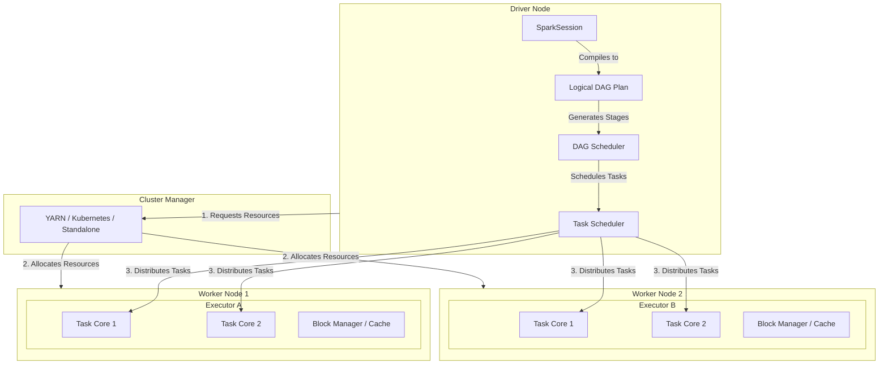

# PySpark & Apache Spark: Comprehensive Theory Study Guide

---

## Module 1: Apache Spark Basics

### 1. Fundamentals
*   **What is Apache Spark?**
    Apache Spark is an open-source, distributed, general-purpose cluster-computing framework. It provides in-memory data processing, making it significantly faster than traditional disk-based distributed engines.
*   **Why was Spark developed?**
    Developed at UC Berkeley's AMPLab in 2009 to address the limitations of **Hadoop MapReduce**. MapReduce was slow due to:
    *   Forced writing of intermediate results to disk between job steps.
    *   Lack of support for iterative computations (crucial for machine learning).
    *   High latency, making interactive data exploration difficult.
*   **What are the features of Spark?**
    *   **In-Memory Computation**: Caches intermediate states in RAM to reduce disk I/O.
    *   **Lazy Evaluation**: Delays execution of transformations until an action is called, optimizing execution paths.
    *   **Fault Tolerance**: Uses Directed Acyclic Graph (DAG) lineage to reconstruct lost data partitions.
    *   **Advanced Analytics**: Bundles native modules for SQL, Streaming, Machine Learning, and Graph processing.
*   **Advantages of Spark**
    *   **Speed**: Up to 100x faster than MapReduce in memory, and 10x faster on disk.
    *   **Usability**: Provides user-friendly APIs in Python, Scala, Java, and R.
    *   **Unified Platform**: Handles batch processing, real-time streaming, SQL analytics, and ML within a single framework.
*   **Spark vs Hadoop MapReduce**

    | Feature | Apache Spark | Hadoop MapReduce |
    | :--- | :--- | :--- |
    | **Processing Speed** | Extremely fast (uses in-memory RDD caching). | Slower (reads/writes to disk after every Map/Reduce step). |
    | **Operations** | Supports map, filter, join, group, and custom actions. | Limited to Map and Reduce operations. |
    | **Lazy Evaluation** | Yes (optimizes execution plans via Catalyst). | No (executes immediately). |
    | **Caching** | Native caching in memory or disk. | No native caching system. |

### 2. Ecosystem & Components
*   **Spark Components**
    1.  **Spark Core**: The engine powering memory management, fault recovery, task scheduling, and basic RDD operations.
    2.  **Spark SQL**: Facilitates querying structured and semi-structured data via SQL and the DataFrame API.
    3.  **Spark Streaming / Structured Streaming**: Processes real-time live data streams using micro-batches or continuous processing.
    4.  **MLlib**: A scalable machine learning library containing classification, regression, clustering, and pipeline utilities.
    5.  **GraphX**: API for graphs and graph-parallel computation (Scala/Java only).
*   **Spark Ecosystem**
    Integrates with various language APIs (Scala, Python, Java, R), storage systems (HDFS, Amazon S3, Azure ADLS, Cassandra, HBase, Kafka), and cluster managers (YARN, Kubernetes, Standalone, Mesos).
*   **What is PySpark?**
    The Python API for Apache Spark. It allows developers to write Python code that leverages Spark's distributed processing power by using the **Py4J** library to bridge Python objects to Java Virtual Machine (JVM) executors.
*   **Why use PySpark?**
    *   Combines Python's ease of learning and rich data analysis ecosystem (Pandas, NumPy, Scikit-Learn) with Spark's scale-out computing.
    *   Easy integration with Jupyter notebooks and modern cloud environments (Databricks, AWS EMR, GCP Dataproc).
*   **Spark Applications**
    *   Real-time analytics and telemetry tracking.
    *   Large-scale ETL (Extract, Transform, Load) data pipelines.
    *   Distributed machine learning training and batch model inference.
    *   Graph analysis and social network connection mapping.

---

## Module 2: Spark Architecture

### 1. Cluster Diagram
Apache Spark runs in a master-worker master design managed by a Cluster Manager:



### 2. Architecture Components
*   **Driver Program**
    The central coordinator process. It runs the user's `main()` code, creates the `SparkSession`, builds the Directed Acyclic Graph (DAG) execution plan, splits jobs into stages, schedules tasks, and coordinates worker nodes.
*   **SparkSession**
    Introduced in Spark 2.0. A unified entry point for Spark applications, consolidating historical contexts like `SparkContext`, `SQLContext`, and `HiveContext` under a single object.
*   **Cluster Manager**
    An external service that allocates physical or virtual resources across the cluster (e.g., Standalone, Apache YARN, Mesos, or Kubernetes).
*   **Worker Nodes**
    The physical or virtual machines in the cluster that host and run the Executor processes.
*   **Executors**
    Processes spawned on Worker Nodes that run individual Spark tasks, hold data partitions in memory or disk cache, and report metrics back to the Driver.
*   **Tasks**
    The smallest unit of execution work. A task represents a set of operations run on a single executor core for a single data partition.
*   **Jobs**
    A parallel computation triggered by calling an Action (e.g. `collect()`). Each action spawns a Job.
*   **Stages**
    A Job is split into Stages. Stages are divided by **Shuffle boundaries** (wide transformations where data must be redistributed across different nodes).
*   **Spark Execution Flow**
    1.  The user runs code, instantiating the `SparkSession` on the **Driver**.
    2.  The Driver registers with the **Cluster Manager** to request resources.
    3.  The Cluster Manager spawns **Executors** on the **Worker Nodes**.
    4.  The Driver compiles code into a **DAG** of logical transformations.
    5.  The **DAG Scheduler** breaks the DAG into **Stages** based on shuffle boundaries.
    6.  The **Task Scheduler** submits **Tasks** (by partition) to the Executors.
    7.  Executors execute the tasks and send results back to the Driver or write to disk.

---

## Module 3: RDD (Resilient Distributed Dataset)

*   **What is RDD?**
    The fundamental, low-level data abstraction in Apache Spark. It represents an immutable, partitioned, read-only collection of objects distributed across the cluster.
*   **Features & Characteristics of RDD**
    *   **Resilient**: If a node crashes and a partition is lost, Spark recomputes that partition using the DAG lineage history.
    *   **Distributed**: Data is divided into partitions distributed across cluster nodes.
    *   **Immutable**: RDDs cannot be modified in-place; modifications yield a new RDD.
    *   **Lazy Evaluation**: Calculations are recorded but not run until an action is called.
    *   **Partitioned**: Divided into chunks of data.
*   **How to create RDD?**
    1.  **Parallelizing an existing collection**:
        ```python
        rdd = spark.sparkContext.parallelize([1, 2, 3, 4, 5])
        ```
    2.  **Reading from external storage**:
        ```python
        rdd = spark.sparkContext.textFile("hdfs://path/to/file.txt")
        ```
*   **RDD Operations**
    Divided into **Transformations** (lazy operations that create a new RDD, e.g., `map()`, `filter()`) and **Actions** (operations that trigger execution and return values to the driver, e.g., `count()`, `collect()`).
*   **Advantages of RDD**
    *   Fine-grained control over partition layouts and custom execution logic.
    *   Strict type-safety (in Scala and Java).
    *   Well-suited for unstructured data streams.
*   **Limitations of RDD**
    *   **No Catalyst Optimization**: Spark cannot inspect the contents of RDD operations to optimize the query plan.
    *   **Serialization Overhead**: Python RDDs require expensive Py4J serialization between the JVM and Python worker processes.
    *   **Lack of Schema**: Does not support named columns or data types, making querying harder.
*   **RDD vs DataFrame**
    RDDs are low-level collections of JVM objects without schema optimization. DataFrames are structured collections organized into named columns, optimized via the Catalyst query engine.

---

## Module 4: DataFrame

*   **What is DataFrame?**
    A distributed collection of data organized into named columns, equivalent to a table in a relational database or a DataFrame in Pandas, but optimized for cluster scale.
*   **Features & Advantages of DataFrame**
    *   **Structured Schema**: Holds named columns with defined data types.
    *   **Catalyst Optimizer**: Automatically optimizes logical and physical query plans.
    *   **Language-Agnostic Performance**: Python and Scala DataFrames run at the same speed because the queries are compiled to JVM bytecode.
*   **DataFrame vs RDD**
    DataFrames run faster, consume less memory, and support SQL syntax. RDDs require manual code optimization and lack metadata schemas.
*   **DataFrame vs Pandas DataFrame**
    *   **Pandas DataFrame**: Runs on a single node, is eagerly evaluated, and is limited by local RAM limits.
    *   **Spark DataFrame**: Distributed across a cluster, lazily evaluated, fault-tolerant, and scales to petabytes.
*   **DataFrame Operations & API**
    Includes operations like `select()`, `filter()`, `withColumn()`, `groupBy()`, `join()`, and `write()`.
*   **DataFrame Schema**
    Defines column names and data types. Can be inferred automatically or defined explicitly using `StructType` and `StructField` to prevent inference errors:
    ```python
    from pyspark.sql.types import StructType, StructField, StringType, IntegerType

    schema = StructType([
        StructField("name", StringType(), True),
        StructField("age", IntegerType(), True)
    ])
    ```
*   **DataFrame Optimization**
    Utilizes partition pruning, predicate pushdown, and off-heap memory management (Tungsten).

---

## Module 5: Dataset (Scala Concept)

*   **What is Dataset?**
    An extension of the DataFrame API that provides a strongly-typed, object-oriented programming interface.
*   > [!IMPORTANT]
    > Datasets are only available in Scala and Java. They are not supported in PySpark because Python is a dynamically typed language without compile-time type-safety checks.
*   **Dataset vs DataFrame**
    A DataFrame is a Dataset of generic `Row` objects. In Scala, a Dataset can be mapped to a case class for type checking at compile-time: `Dataset[User]`.
*   **Dataset vs RDD**
    Datasets combine the optimization benefits of the Catalyst Optimizer and Tungsten engine with the type-safety and object-oriented benefits of RDDs.

---

## Module 6: Transformations

Transformations are lazy operations that create a new RDD or DataFrame.

### 1. Types of Transformations
*   **Narrow Transformation**
    Operations where data in a single partition depends on only one parent partition. No data movement over the network is required.
    *   *Examples*: `map()`, `flatMap()`, `filter()`, `select()`, `withColumn()`, `drop()`.
*   **Wide Transformation (Shuffle)**
    Operations where data in a partition depends on data from multiple parent partitions across the cluster. Triggers a **Shuffle** (network redistribution).
    *   *Examples*: `groupBy()`, `distinct()`, `join()`, `orderBy()`, `sort()`.

### 2. Core Transformations Reference
*   `map(func)`: Applies a function to each element of the dataset (RDD level).
*   `flatMap(func)`: Similar to `map()`, but flattens the output array of elements:
    ```python
    rdd.flatMap(lambda line: line.split(" ")) # Flattens to list of words
    ```
*   `filter(condition)`: Retains elements matching the condition:
    ```python
    df.filter(df.age > 21)
    ```
*   `select(*cols)`: Projects specific columns:
    ```python
    df.select("name", "age")
    ```
*   `withColumn(colName, colExpr)`: Adds or replaces a column:
    ```python
    df.withColumn("double_age", df.age * 2)
    ```
*   `drop(colName)`: Removes a column.
*   `distinct()`: Removes duplicate records (wide transformation).
*   `groupBy(*cols)`: Groups rows for aggregation:
    ```python
    df.groupBy("department").avg("salary")
    ```
*   `orderBy(*cols)` / `sort()`: Sorts rows.
*   `union(other)`: Combines two DataFrames by row union.
*   `join(other, on, how)`: Joins two DataFrames on a key.

---

## Module 7: Actions

Actions trigger the execution of the saved transformations by evaluating the DAG and returning results to the Driver or writing them to disk.

*   `collect()`: Returns the entire dataset to the Driver as a local list.
    > [!CAUTION]
    > Avoid calling `collect()` on massive datasets, as it can overload the Driver's memory and trigger an OutOfMemory (OOM) error.
*   `count()`: Returns the total number of rows.
*   `first()`: Returns the first row.
*   `take(n)`: Returns the first `n` rows.
*   `show(n)`: Prints the first `n` rows in a tabular format to console.
*   `reduce(func)`: Aggregates elements using a commutative function.
*   `foreach(func)`: Applies a function to each row (commonly used for writing database records).
*   `write()`: Saves the DataFrame output to external storage (HDFS, S3, Parquet, CSV).

---

## Module 8: Lazy Evaluation

*   **What is Lazy Evaluation?**
    Spark does not run transformations on data immediately. Instead, it records the transformations as lineage steps in a Directed Acyclic Graph (DAG). Execution only occurs when an Action is invoked.
*   **Why does Spark use Lazy Evaluation?**
    It allows the Catalyst Optimizer to inspect the entire chain of transformations, optimize the execution plan (e.g., combining filters, skipping column reads), and reduce physical data movement.
*   **Advantages**
    *   **Query Optimization**: Predicates are pushed down directly to data sources (Predicate Pushdown).
    *   **Fault Tolerance**: If a node fails, Spark re-runs the recorded lineage steps to recompute the lost data partition.
    *   **Reduced Memory Usage**: Prevents saving redundant intermediate states in memory.
*   **Example**
    ```python
    df = spark.read.csv("file.csv")
    df_filtered = df.filter(df.age > 30) # No execution
    df_select = df_filtered.select("name") # No execution
    df_select.show() # Action called! Execution starts.
    ```
    *Catalyst Optimization*: Instead of reading the whole CSV, filtering, and selecting, Spark optimizes the query plan to only load the `age` and `name` columns from disk and filters records on-read.

---

## Module 9: DAG (Directed Acyclic Graph)

*   **What is DAG?**
    A logical flow model representing the sequence of transformations applied to the data. Vertices represent RDDs/DataFrames, and edges represent transformations.
*   **DAG Scheduler**
    The Spark Driver component that receives the logical DAG, optimizes it, and breaks it down into physical **Stages** of execution based on shuffle boundaries.
*   **DAG Execution**
    1.  The user calls an Action.
    2.  The DAG Scheduler builds a physical execution plan of Stages.
    3.  Stages are sent to the **Task Scheduler**, which assigns Tasks to individual Executor cores.
*   **DAG vs Lineage**
    *   **Lineage** is the record of dependencies of a partition, used to rebuild lost partitions.
    *   **DAG** is the overall physical query execution plan mapping out both narrow and wide operations.
*   **Advantages of DAG**
    *   Enables automated optimization of steps.
    *   Powers fault tolerance (if an executor fails, Spark knows exactly how to recompute the lost part).

---

## Module 10: Partitioning

*   **What is Partition?**
    A logical chunk of a large distributed dataset. In Spark, data is processed in parallel across partitions.
*   **Why Partitioning?**
    Proper partitioning ensures that all Executor cores are utilized, data is balanced across nodes (avoiding data skew), and network shuffle is minimized.
*   **Default Partitioning**
    For file reads, Spark creates partitions based on input file splits (typically 128 MB blocks). For shuffle operations, the default partition count is **200** (configured via `spark.sql.shuffle.partitions`).
*   **Partition Pruning**
    An optimization where Spark reads only the partition folders matching query filters, bypassing irrelevant directories on disk:
    ```sql
    SELECT * FROM Sales WHERE year = 2026; -- Reads only the year=2026 partition folder
    ```
*   **Custom Partitioning**
    Users can partition data by specific columns using `partitionBy()` when writing data to disk to optimize future queries:
    ```python
    df.write.partitionBy("country").parquet("hdfs://...")
    ```

---

## Module 11: Repartition vs Coalesce

*   **What is `repartition()`?**
    A wide transformation that increases or decreases the number of partitions. It performs a full, random reshuffling of all data across the cluster over the network.
*   **What is `coalesce()`?**
    A narrow transformation used **only to decrease** the number of partitions. It merges adjacent partitions on the same executor node without triggering a full network shuffle.
*   **Comparison**

    | Feature | `repartition()` | `coalesce()` |
    | :--- | :--- | :--- |
    | **Partition Change** | Can increase or decrease partitions. | Can only decrease partitions. |
    | **Network Shuffle** | Full shuffle of data ($O(N)$ network load). | Minimizes shuffle (local merging). |
    | **Partition Size** | Produces uniform partition sizes. | Can lead to uneven/skewed partition sizes. |
    | **Speed** | Slower due to network I/O. | Faster because it avoids network I/O. |

*   **When to use each?**
    *   Use `repartition()` when you need to increase partitions for higher parallelism, or balance skewed data partitions.
    *   Use `coalesce()` to reduce partitions immediately before writing output files to disk.

---

## Module 12: Cache & Persist

Caches intermediate DataFrames in memory to speed up downstream queries.

*   `cache()`: Shortcut to persist data using the default storage level `MEMORY_AND_DISK`.
*   `persist()`: Allows custom storage levels.
*   **Storage Levels**

    | Storage Level | Location | Serialized? | Replicated? | Behavior |
    | :--- | :--- | :--- | :--- | :--- |
    | `MEMORY_ONLY` | RAM | No | No | Stores as objects in memory. If full, spills nothing (recomputes). |
    | `MEMORY_AND_DISK` | RAM & Disk | No | No | Stores in memory. Spills excess partitions to disk. |
    | `DISK_ONLY` | Disk | Yes | No | Stores on local disk only. |
    | `MEMORY_ONLY_SER` | RAM | Yes (Java) | No | Stores as serialized bytes. Consumes less memory but higher CPU overhead. |
    | `MEMORY_AND_DISK_2` | RAM & Disk | No | Yes (2 Nodes) | Replicates partitions to two cluster nodes for fault tolerance. |

---

## Module 13: Broadcast Variable

*   **What is Broadcast Variable?**
    A read-only variable that Spark caches on every worker node once, rather than sending a copy of it with every task.
*   **Advantages**
    Reduces network traffic and serialization overhead across tasks.
*   **Broadcast Join (Broadcast Hash Join)**
    When joining a large table with a small table, Spark sends (broadcasts) the small table to all executors. Each executor performs a local hash join, avoiding a network shuffle of the large table.
*   **When to use Broadcast Join?**
    When the small table fits in the executor's memory. The default threshold is **10 MB** (configured via `spark.sql.autoBroadcastJoinThreshold`).
    ```python
    from pyspark.sql.functions import broadcast
    df_large.join(broadcast(df_small), "id")
    ```

---

## Module 14: Accumulator

*   **What is Accumulator?**
    A shared write-only variable that executors can update (e.g., adding to a counter), but only the Driver program can read.
*   **Advantages**
    Useful for implementing diagnostic counters or tracking dirty records during execution.
*   **Broadcast vs Accumulator**
    *   **Broadcast**: Read-only for executors. Sent from Driver to executors.
    *   **Accumulator**: Write-only for executors. Updates are aggregated back to the Driver.

---

## Module 15: UDF (User Defined Function)

*   **What is UDF?**
    A custom column transformation function written by the developer.
*   **Why use UDF?**
    To implement complex processing logic that cannot be expressed using built-in Spark SQL functions.
*   **Types of UDF**
    *   **Standard PySpark UDF**: Runs slow due to Python-JVM serialization overhead.
    *   **Vectorized UDF (Pandas UDF)**: Introduced in Spark 2.3. Uses **Apache Arrow** to transfer data in batches, executing using Pandas/NumPy vector operations (significantly faster).
*   **Limitations of UDF**
    PySpark UDFs act as a black box to the Catalyst Optimizer, preventing optimization steps like predicate pushdown.
*   **UDF vs Built-in Functions**
    Always prefer built-in functions (e.g., `coalesce()`, `concat()`). They run natively within the JVM and are optimized by Catalyst.

---

## Module 16: Spark SQL

*   **What is Spark SQL?**
    A Spark module for structured data processing, providing a SQL interface and execution framework.
*   **Spark SQL vs SQL**
    SQL is a query language standard. Spark SQL is a distributed engine that translates SQL queries into physical RDD tasks executed across a cluster.
*   **Temporary View**
    A local view scoped to the active `SparkSession`. It is deleted when the session terminates.
    ```python
    df.createOrReplaceTempView("my_temp_table")
    ```
*   **Global Temporary View**
    A view shared across all `SparkSession` instances in the application. Scoped under the `global_temp` database.
    ```python
    df.createOrReplaceGlobalTempView("my_global_table")
    ```

---

## Module 17: Joins

*   **Inner Join**: Returns rows where join keys match in both DataFrames.
*   **Left Join**: Returns all rows from the left, with matched columns from the right.
*   **Right Join**: Returns all rows from the right, with matched columns from the left.
*   **Full Join**: Returns all rows from both, matching where possible.
*   **Cross Join**: Cartesian product of both tables.
*   **Left Semi Join**: Returns rows from the left DataFrame where a match exists in the right DataFrame. Columns from the right DataFrame are not included.
*   **Left Anti Join**: Returns rows from the left DataFrame where **no** match exists in the right DataFrame.
*   **Broadcast Join**: Local join avoiding shuffles by broadcasting the small table.
*   **Shuffle Join (Sort-Merge Join)**: The default join for large datasets. Reshuffles both tables by join key, sorts them, and merges them across the cluster. Highly network-intensive.

---

## Module 18: Window Functions

Used to calculate values across partitions of rows without collapsing the rows.
*   **Core Functions**: `ROW_NUMBER()`, `RANK()`, `DENSE_RANK()`, `LEAD()`, `LAG()`.
*   **Example**:
    ```python
    from pyspark.sql.window import Window
    from pyspark.sql.functions import rank

    windowSpec = Window.partitionBy("department").orderBy(df.salary.desc())
    df.withColumn("rank", rank().over(windowSpec)).show()
    ```

---

## Module 19: Shuffle

*   **What is Shuffle?**
    The process of redistributing data partitions across different nodes in the cluster. It occurs during wide transformations (e.g., `groupBy()`, `join()`).
*   **Why Shuffle is expensive?**
    *   Requires writing intermediate data to local disk.
    *   Involves heavy network serialization and deserialization.
    *   Triggers CPU context switching and disk I/O bottlenecks.
*   **How to reduce Shuffle?**
    *   Use Broadcast Joins for small datasets.
    *   Filter and aggregate data early in the pipeline.
    *   Use Bucketing to pre-sort and partition tables.
    *   Adjust `spark.sql.shuffle.partitions` to match the data scale.

---

## Module 20: Catalyst Optimizer

*   **What is Catalyst Optimizer?**
    The query optimization engine used by Spark SQL and the DataFrame API.
*   **How Catalyst works (4 Phases)**
    1.  **Analysis**: Resolves relations, tables, and column names against the Catalog.
    2.  **Logical Optimization**: Applies rule-based optimizations (e.g., Constant Folding, Predicate Pushdown, Projection Pruning).
    3.  **Physical Planning**: Generates multiple physical plans and uses a cost model (Cost-Based Optimizer) to select the physical execution plan.
    4.  **Code Generation**: Uses Quasiquotes to compile physical query plans into Java bytecode (Java Class files) at runtime.

---

## Module 21: Tungsten Engine

*   **What is Tungsten?**
    An optimization engine focused on improving execution speeds at the hardware level.
*   **Key Optimizations**
    *   **Off-Heap Memory Management**: Employs a custom binary allocator (`sun.misc.Unsafe`) to bypass the JVM Garbage Collector.
    *   **Whole-Stage Code Generation**: Collapses multiple query steps into a single Java function loop, avoiding virtual function call steps.
    *   **Cache-aware Computation**: Uses CPU L1/L2/L3 cache layouts to speed up sorting and aggregations.

---

## Module 22: Serialization

*   **Serialization**
    Converting objects into a byte stream for transmission across the network or writing to disk.
*   **Java Serialization**: Default serializer. Highly flexible but slow and produces massive byte streams.
*   **Kryo Serialization**: A fast, compact binary serialization framework.
*   **Which is faster?**
    Kryo is up to 10x faster and produces smaller byte outputs than Java serialization. Configured via:
    ```python
    spark.conf.set("spark.serializer", "org.apache.spark.serializer.KryoSerializer")
    ```

---

## Module 23: File Formats

*   **CSV & JSON**: Row-based, text-based. No built-in schema storage, slow to query, and does not support compression index lookups.
*   **Parquet**: Columnar binary format. Stores metadata schema, supports compression, and powers **Predicate Pushdown** and **Column Pruning**.
*   **ORC**: Columnar format optimized for Hive.
*   **Avro**: Row-based binary format. Best suited for write-heavy streaming operations (e.g., Kafka ingest).
*   **Which format is best?**
    Parquet is best for analytical (read-heavy) workloads. Avro is best for streaming (write-heavy) operations.
*   **Parquet vs CSV**
    Parquet is significantly faster for queries because it allows Spark to read only the columns requested (Column Pruning) and skip reading irrelevant rows (Predicate Pushdown).

---

## Module 24: Performance Optimization

### 1. Key Optimization Strategies
*   **Reduce Shuffle**: Filter datasets early, and use map-side aggregations.
*   **Broadcast Join**: Use when joining a large dataset with a small lookup table.
*   **Cache / Persist**: Cache intermediate datasets that are referenced multiple times downstream.
*   **Partitioning**: Ensure data is partitioned evenly. Avoid data skew where one executor processes most of the data.
*   **Bucketing**: Pre-partition and sort tables on a join key when writing them, avoiding shuffles during joins:
    ```python
    df.write.bucketBy(10, "id").sortBy("id").saveAsTable("bucketed_table")
    ```
*   **Predicate Pushdown**: Let the database/parquet reader filter rows before loading data into RAM.
*   **Column Pruning**: Select only the columns needed, reducing I/O.
*   **Explain Plan**: Inspect plans via `df.explain(True)` to analyze physical plans.

---

## Module 25: Fault Tolerance

*   **What is Fault Tolerance?**
    Spark's ability to recover from node failures without failing the entire application.
*   **Lineage**
    Spark tracks the history of transformations (lineage graph) used to create an RDD/DataFrame. If a worker node crashes, the Driver assigns another node to recompute the missing partition based on the lineage.
*   **Checkpointing**
    Saves the physical state of a DataFrame/RDD to a reliable storage system (like HDFS or S3) and cuts the lineage chain. Useful in long pipelines or iterative algorithms (ML) where the lineage graph becomes too deep.
*   **Lineage vs Checkpoint**
    *   **Lineage** is kept in memory on the Driver, tracing execution steps.
    *   **Checkpoint** is written to disk (HDFS/S3), deleting the lineage history up to that point.

---

## Module 26: Spark Cluster Managers

*   **Standalone**: Built-in simple resource manager.
*   **YARN**: Apache Hadoop's resource manager. Standard for on-premise clusters.
*   **Mesos**: A generic cluster resource manager (less common).
*   **Kubernetes**: Container orchestration platform. Standard for cloud-native deployments.
*   **Which Cluster Manager is best?**
    Kubernetes for containerized, dynamic cloud environments. YARN for legacy Hadoop infrastructure.

---

## Module 27: ETL (Extract, Transform, Load)

*   **ETL Pipeline**:
    *   **Extract**: Reading data from databases (JDBC), files (Parquet, CSV, JSON), or real-time streams (Kafka).
    *   **Transform**: Cleaning data (casting column types, handling `null` values, filtering out invalid rows) and executing aggregations or joins.
    *   **Load**: Writing the final data into a target Data Lake (Delta Lake, Parquet) or Data Warehouse (Snowflake, Redshift).

---

## Module 28: Interview Scenario Questions

### 1. Why is your Spark job slow?
Usually caused by:
*   **Data Skew**: One partition has significantly more data than others, causing one executor core to work while others sit idle.
*   **Spill to Disk**: Executors running out of memory, causing partitions to write (spill) to disk, slowing down processing.
*   **Excessive Shuffling**: Too many wide transformations without partitioning optimizations.
*   **Improper Partition Count**: Too few partitions (low parallelism) or too many partitions (scheduling overhead).

### 2. How do you optimize a Spark job?
1.  Enable **Broadcast Joins** for small lookup tables.
2.  Use **Coalesce** instead of Repartition to decrease partitions.
3.  Pre-sort and partition using **Bucketing** on frequently joined keys.
4.  Replace Python UDFs with native **Spark SQL functions** or **Pandas UDFs**.
5.  Tune executor memory options (`spark.executor.memory`, `spark.executor.cores`).

### 3. Difference between cache and persist?
`cache()` uses the default storage level `MEMORY_AND_DISK`. `persist()` allows selecting custom storage levels like `MEMORY_ONLY`, `MEMORY_ONLY_SER`, or `DISK_ONLY`.

### 4. Difference between repartition and coalesce?
`repartition()` shuffles all data to adjust partition counts (either up or down). `coalesce()` decreases partition counts without shuffling data, by merging local partitions.

### 5. Difference between narrow and wide transformations?
Narrow transformations do not require moving data over the network (e.g., `map`, `filter`). Wide transformations require shuffling data across nodes (e.g., `groupBy`, `join`), which is expensive.

### 6. Difference between DataFrame and RDD?
RDD is a low-level collection of objects without schema definitions or optimizer support. DataFrame is a structured collection with a schema, optimized by the Catalyst and Tungsten engines.

### 7. Why use DataFrame instead of RDD?
DataFrames offer optimization out-of-the-box (Predicate Pushdown, Code Generation) and uniform execution speed regardless of language (Python, Scala). RDDs are slow in Python due to JVM-Python communication overhead.

### 8. Why is shuffle expensive?
It involves local disk writes, network transmission, serialization/deserialization, and sorting data across nodes, creating I/O bottlenecks.

### 9. Why is Parquet better than CSV?
Parquet is columnar, compressed, stores schema metadata, and supports column pruning and predicate pushdown, allowing Spark to scan less data.

### 10. How does Spark achieve fault tolerance?
Through RDD **Lineage**. If an executor fails, the Driver reconstructs only the lost partition using the lineage DAG plan.

### 11. What is lineage?
A logical graph containing the history of transformations used to build a specific dataset.

### 12. What is checkpointing?
Saving RDD/DataFrame state to HDFS/S3 to break the lineage chain, avoiding stack overflows in deep iterative computations.

### 13. What is broadcast join?
Sending a copy of a small table to all executors so they can join locally, avoiding a full network shuffle of the larger table.

### 14. When should you avoid UDFs?
Avoid standard Python UDFs for basic operations because they require data to be serialized out of the JVM into Python and back, bypassing Catalyst optimizations. Use built-in functions instead.

### 15. How does Catalyst Optimizer improve performance?
It optimizes the query plan by rearranging filters (predicate pushdown), removing unused columns (projection pruning), and compiling queries directly into JVM bytecode.

### 16. How do you handle skewed data?
*   Use **Salting**: Add a random prefix key to the join column to distribute skewed values across partitions, then remove the prefix after joining.
*   Enable **Adaptive Query Execution (AQE)**, which automatically detects skew and splits skewed partitions at runtime.

### 17. How do you tune Spark performance?
*   Adjust partition sizes (`spark.sql.shuffle.partitions`).
*   Tune memory fractions (`spark.memory.fraction`).
*   Increase executor cores to 2-5 for optimal thread performance.
*   Enable Kryo serialization.

### 18. What is partition pruning?
An optimization where Spark reads only the partition directories matching the filter, skipping unrelated files on disk.

### 19. How do you process billions of records efficiently?
1.  Use Parquet/Delta formats.
2.  Enable bucketing and partition pruning.
3.  Tune executor cores and memory allocations.
4.  Enable AQE (Adaptive Query Execution).

### 20. What happens internally when you call show()?
`show()` is an Action. It creates a Job, triggers DAG planning, executes tasks only for the first few partitions, and prints the result rows directly to the Driver's console.

### 21. Explain Spark execution from Driver to Executor.
The Driver compiles code -> builds DAG -> DAG Scheduler splits plan into Stages -> Task Scheduler assigns Tasks based on partition locations -> Tasks run on Executor cores -> Executors return results to Driver.

### 22. How do you deploy a PySpark application?
Using `spark-submit`:
```bash
spark-submit \
  --master yarn \
  --deploy-mode cluster \
  --num-executors 10 \
  --executor-cores 4 \
  --executor-memory 8G \
  my_script.py
```

### 23. How do you debug a failed Spark job?
1.  Check the **Spark UI** to identify which Stage and Task failed.
2.  Inspect executor logs for OutOfMemory (OOM) errors or class serialization issues.
3.  Run `df.explain(True)` to check the execution plan.
4.  Check for data skew by inspecting task runtime distributions in the Spark UI.
