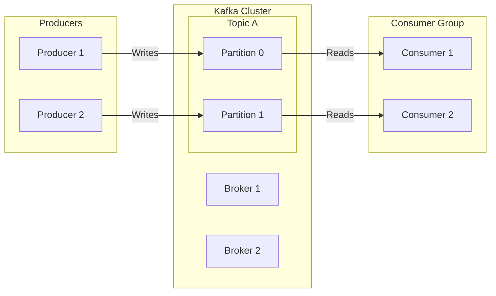

# Data Engineering: Comprehensive Theory and Concepts Study Guide

---

## Module 1: Data Engineering Fundamentals

*   **What is Data Engineering?**
    Data Engineering is the practice of designing, building, and maintaining systems, architectures, and pipelines for collecting, storing, validating, and preparing data for analytical or machine learning consumption at scale.
*   **Roles and Responsibilities of a Data Engineer**
    *   Developing and maintaining automated data ingestion pipelines (ETL/ELT).
    *   Designing optimized database schemas (star/snowflake, relational, NoSQL).
    *   Ensuring data quality, consistency, and lineage across systems.
    *   Configuring data warehouse and data lake structures.
    *   Partnering with Data Scientists and Analysts to prepare production datasets.
*   **Data Engineering Lifecycle**
    The path data takes: Generation (source systems) $\to$ Ingestion (extract) $\to$ Storage (datalake/warehouse) $\to$ Transformation (cleaning/modeling) $\to$ Serving (APIs, BI reports). Transversal to these stages are Security, Monitoring, and Governance.
*   **Data Pipeline**
    An automated sequence of processes that moves data from one or more source systems to an analytical target, transforming the format along the way.
*   **Batch Processing**
    Processing data in large blocks at scheduled intervals (e.g., hourly, daily). Best suited for high-volume historical calculations where latency is not critical (e.g., Spark, Hadoop).
*   **Stream Processing**
    Processing data continuously in real-time, event-by-event as it arrives. Essential for low-latency notifications or live dashboards (e.g., Apache Flink, Spark Structured Streaming).
*   **ETL (Extract, Transform, Load)**
    Data is extracted from sources, transformed in a staging server (e.g., cleaning, joining), and loaded into a data warehouse. Used when compute in the target warehouse is limited or expensive.
*   **ELT (Extract, Load, Transform)**
    Data is extracted, loaded directly into the target cloud warehouse, and transformed using the target's scalable compute. The modern cloud standard (e.g., Snowflake, BigQuery).
*   **Data Ingestion**: The process of importing data from source systems (databases, APIs, logs) into a landing zone. Can be batch or real-time.
*   **Data Validation**: Checking incoming data against structural rules (schemas, types, null constraints) before loading it into downstream stages.

---

## Module 2: Database Design

*   **OLTP (Online Transactional Processing)**: Optimized for high volumes of fast, simple write/read operations (inserts, updates, deletes). Normalized to 3NF to avoid redundancy. (e.g., PostgreSQL, MySQL).
*   **OLAP (Online Analytical Processing)**: Optimized for complex, read-heavy queries scanning millions of rows. Denormalized (star schema) to minimize joins. (e.g., Snowflake, Redshift).
*   **Data Modeling Levels**
    *   **Conceptual Model**: High-level, non-technical business concepts and relationships.
    *   **Logical Model**: Defines columns, keys, and relationships independent of the target database engine.
    *   **Physical Model**: The actual database implementation containing specific data types, indexes, and constraints.
*   **ER Diagram (Entity-Relationship Diagram)**: A visual representation of database tables, column attributes, and primary/foreign key connections.
*   **Cardinality**: Defines numerical relationships between tables (One-to-One, One-to-Many, Many-to-Many).
*   **Normalization**: The process of organizing tables to eliminate data redundancy and anomalies (1NF, 2NF, 3NF).
*   **Denormalization**: Intentionally introducing redundant data to speed up analytical read queries by reducing the count of table joins.

---

## Module 3: Data Warehouse

*   **What is a Data Warehouse?**
    A centralized database system optimized for analytical querying (OLAP), consolidating integrated data from multiple operational sources.
*   **Characteristics of a Data Warehouse**
    1.  **Subject-Oriented**: Organized around business concepts (e.g., Sales, Inventory) rather than operations.
    2.  **Integrated**: Standardizes data formats from disparate sources.
    3.  **Time-Variant**: Stores historical data to analyze trends over time.
    4.  **Non-Volatile**: Data is read-only once loaded; updates do not overwrite historical states.
*   **Data Mart**
    A subset of a data warehouse focused on a specific business unit or department (e.g., Marketing Data Mart).
*   **Enterprise Data Warehouse (EDW)**: A centralized data warehouse that manages all analytical data assets across the entire organization.
*   **Operational Data Store (ODS)**: A temporary database used to store operational data for real-time reporting before it is loaded into the data warehouse.
*   **Metadata**: "Data about data" (e.g., table schemas, update frequencies, access logs).
*   **Data Dictionary**: A detailed catalog describing names, descriptions, types, and relationships of all columns in database tables.

---

## Module 4: Schema Design

*   **Star Schema**: A central Fact Table directly connected to denormalized Dimension Tables. Simpler query structure, fast read times.
*   **Snowflake Schema**: A variation where Dimension Tables are normalized into sub-dimensions (e.g., Product $\to$ Category $\to$ Department). Reduces redundancy but increases join overhead.
*   **Galaxy Schema (Fact Constellation)**: Contains multiple Fact Tables sharing common Dimension Tables.
*   **Fact Table vs Dimension Table**
    *   **Fact Table**: Contains quantitative business measurements (e.g., price, quantity) and foreign keys. Long and narrow.
    *   **Dimension Table**: Contains descriptive context surrounding facts (e.g., customer names, dates). Short and wide.
*   **Factless Fact Table**: A fact table containing only foreign keys and no numeric facts. Used to record event occurrences (e.g., student attendance events).
*   **Slowly Changing Dimensions (SCD)**
    *   **SCD Type 0**: Retains original value. Changes are ignored.
    *   **SCD Type 1**: Overwrites old data with new data. No history is kept.
    *   **SCD Type 2**: Inserts a new row for every change, tracking history using active dates and status flags (`start_date`, `end_date`, `is_active`). The data warehouse standard.
    *   **SCD Type 3**: Creates a new column to store the immediate previous value.
*   **Keys**
    *   **Surrogate Key**: A system-generated auto-incremented integer used as a primary key. Insulates the warehouse from source business key changes.
    *   **Natural Key**: A business key from the source system (e.g., Social Security Number, Email).

---

## Module 5: Data Lake & Lakehouse

*   **What is a Data Lake?**
    A storage repository that holds raw data in its native format—structured, semi-structured, and unstructured—at low cost.
*   **Data Lake vs Data Warehouse**

    | Feature | Data Lake | Data Warehouse |
    | :--- | :--- | :--- |
    | **Data Types** | Structured, semi-structured, unstructured. | Structured data only. |
    | **Schema Model** | Schema-on-Read. | Schema-on-Write. |
    | **Storage Cost** | Very low (object storage like S3). | Higher (structured database storage). |
    | **Users** | Data Scientists, ML Engineers. | BI Analysts, Business Users. |

*   **Data Formats**: Structured (relational tables), Semi-Structured (JSON, CSV, XML), Unstructured (images, video, audio, logs).
*   **Data Lakehouse**
    A modern architecture combining the cheap, flexible object storage of a Data Lake with the ACID transactions, schema enforcement, and SQL optimizations of a Data Warehouse.
*   **Open Table Formats**
    *   **Delta Lake**: Open-source storage layer built on Parquet. Supports ACID transactions, time travel (versioning), and schema enforcement (Databricks native).
    *   **Apache Iceberg**: High-performance open table format for massive datasets, featuring schema evolution, hidden partitioning, and file-level statistics.
    *   **Apache Hudi**: Optimized for incremental upserts and deletes on object storage.

---

## Module 6: File Formats

*   **CSV**: Row-based, flat text. No schema metadata, slow to query, uncompressed.
*   **JSON & XML**: Hierarchical text formats. Flexible but verbose, with high parsing CPU overhead.
*   **Parquet**: Columnar binary format. Stores metadata schema, is highly compressed, and optimized for analytical queries via **Column Pruning** and **Predicate Pushdown**.
*   **ORC (Optimized Row Columnar)**: Columnar format highly optimized for Hive queries.
*   **Avro**: Row-based binary format. Stores schemas in JSON. Optimized for write-heavy streaming pipelines (e.g., Kafka).
*   **Delta Format**: Parquet files coupled with a JSON transaction log directory (`_delta_log`).
*   **Comparisons**
    *   *Parquet vs ORC*: Parquet is the industry standard (best for Spark/Databricks). ORC is optimized specifically for Hive.
    *   *Parquet vs CSV*: Parquet is columnar, binary, and compressed, making it orders of magnitude faster than flat-text row-based CSVs for analytical queries.

---

## Module 7: Partitioning

*   **What is Partitioning?**
    Splitting a large database table into smaller physical segments (folders) on disk based on a partition key column.
*   **Types of Partitioning**
    *   **Horizontal Partitioning**: Splitting a table by rows (e.g., storing rows for `Year=2026` in a separate folder).
    *   **Vertical Partitioning**: Splitting a table by columns (e.g., storing infrequently accessed wide text columns in a separate table).
    *   **Dynamic Partitioning**: Spark/Hive automatically creates partition folders at write-time based on data values.
    *   **Static Partitioning**: Explicitly defining partition targets in code when writing data.
*   **Partition Pruning**: Optimization where the query engine skips scanning partition folders that do not match `WHERE` filter clauses, reducing read I/O.
*   **Partition Strategies**:
    *   *Hash*: Distributed using a hash function on the key.
    *   *Range*: Grouped by ranges (e.g., date ranges).
    *   *List*: Grouped by explicit value lists (e.g., country codes).

---

## Module 8: Bucketing

*   **What is Bucketing?**
    Splitting data within a partition folder into a fixed number of physical files based on a hash of a bucket key column.
*   **Bucketing vs Partitioning**
    *   Partitioning creates separate **directories** (folders) on disk. Best for low-cardinality columns (e.g., `Year`, `Region`).
    *   Bucketing creates a fixed number of **files** within those directories. Best for high-cardinality columns (e.g., `UserID`, `ProductID`).
*   **When to use Bucketing?**
    Use on columns frequently used in joins or groupings (`GROUP BY`). If both tables are bucketed on the join key, Spark can perform a join without triggering a network shuffle (Sort-Merge Join).
*   **Advantages**: Eliminates expensive data shuffling, balancing file sizes uniformly.

---

## Module 9: Data Quality

*   **Data Validation**: Checking schemas, null constraints, and value boundaries.
*   **Data Cleansing**: Handling null values, stripping whitespace, deduplicating records, and formatting fields.
*   **Duplicate Removal**: Using window functions or hashes to drop redundant rows.
*   **Outlier Detection**: Flagging records that fall outside statistical ranges (using IQR or Z-score checks).
*   **Data Profiling**: Analyzing datasets to calculate statistical metrics (min, max, mean, count of nulls).
*   **Data Quality Rules**: Writing assertions (e.g., using frameworks like *Great Expectations*) to validate datasets.
*   **Data Lineage**
    Mapping the path data takes from origin source through all transformations to final analytical targets.
    *   *Benefit*: Simplifies auditing, debugging pipeline errors, and compliance tracking.

---

## Module 10: Apache Kafka

An open-source distributed event streaming platform designed for high-throughput, real-time message routing.

### 1. Kafka Architecture


### 2. Kafka Core Components
*   **Producer**: A client application that publishes events to Kafka topics.
*   **Consumer**: A client application that reads events from Kafka topics.
*   **Topic**: A logical channel or category where messages are sent.
*   **Partition**: A physical commit log queue inside a topic. Partitions enable scale-out scalability by distributing topics across multiple brokers.
*   **Offset**: A unique sequential integer ID assigned to each message in a partition, tracking progress.
*   **Broker**: A Kafka server node. A group of brokers forms a cluster.
*   **Consumer Group**: A group of consumers reading from a topic in parallel. Each partition is read by exactly one consumer in the group.
*   **KRaft (Kafka Raft)**: Modern metadata mode replacing ZooKeeper, allowing Kafka to manage metadata internally.

---

## Module 11: Apache Airflow

An open-source workflow orchestration platform to author, schedule, and monitor pipelines.

*   **DAG (Directed Acyclic Graph)**: A Python file defining the workflow structure, tasks, and execution dependencies.
*   **Operators**: The template for a task:
    *   `PythonOperator`: Runs Python code.
    *   `BashOperator`: Runs shell commands.
    *   `SparkSubmitOperator`: Submits Spark jobs.
*   **Sensors**: Special operators that wait for a condition to be met before completing (e.g., `S3KeySensor` waiting for a file arrival).
*   **Scheduler**: Monitors DAG definitions and schedules tasks whose dependencies are met.
*   **Executor**: Defines where and how tasks are run (e.g., `CeleryExecutor` using worker queues, `KubernetesExecutor` running tasks in isolated pods).
*   **XCom**: Cross-communication mechanism allowing tasks to exchange small amounts of metadata.
*   **Airflow Architecture**
    ```
    [Web Server UI] <-> [Database Metadata] <-> [Scheduler] -> [Executor] -> [Workers]
    ```

---

## Module 12: Apache Hadoop

*   **What is Hadoop?**
    An open-source framework for distributed storage and processing of massive datasets across clusters.
*   **HDFS (Hadoop Distributed File System)**
    *   **NameNode**: Master node that manages metadata (file mappings, block locations).
    *   **DataNode**: Worker nodes that store the actual data blocks.
    *   **Secondary NameNode**: Periodically merges Edit Logs with FSImage to keep NameNode metadata compact.
    *   **Block Size**: Default block size is **128 MB**.
    *   **Replication Factor**: Default is **3**, ensuring data durability across node failures.
*   **YARN (Yet Another Resource Negotiator)**
    *   **Resource Manager**: Master node allocating CPU/Memory resources across the cluster.
    *   **Node Manager**: Worker node agent monitoring local container resource usage.

---

## Module 13: Apache Hive

*   **What is Hive?**
    Data warehouse software built on top of Hadoop that allows querying files using a SQL-like language called **HiveQL**.
*   **Managed Table vs External Table**
    *   **Managed Table**: Hive manages both metadata and physical data files. Dropping the table deletes both metadata and data.
    *   **External Table**: Hive manages only metadata. Dropping the table deletes only metadata; raw data files remain on HDFS/S3.
*   **Optimizations**: Implements partitioning, bucketing, and ORC file storage for faster queries.

---

## Module 14: Apache Spark Optimization

*   **Partition Tuning**: Keeping partitions sized between 100-200 MB to prevent scheduling overhead (too many files) or memory spills (too few partitions).
*   **Broadcast Join**: Broadcasting small tables (<10 MB) to executors, replacing network shuffles with local lookups.
*   **Adaptive Query Execution (AQE)**: Optimizes plans at runtime by coalescing shuffle partitions, dynamically switching join strategies, and handling data skew.
*   **Catalyst Optimizer**: Extensible SQL query optimizer performing predicate pushdown, constant folding, and projection pruning.
*   **Tungsten Engine**: Optimizes physical execution using off-heap memory allocation and whole-stage code generation.
*   **Predicate Pushdown**: Filtering data at the storage level (e.g., in Parquet) before loading it into memory.
*   **Column Pruning**: Loading only the columns requested by the query.

---

## Module 15: Cloud Data Engineering (AWS Focus)

*   **AWS Glue**: Serverless ETL service. Crawlers scan S3 data to infer schemas, writing them to the **AWS Glue Data Catalog**.
*   **AWS Athena**: Serverless interactive query service that runs SQL queries on S3 files using Presto under the hood.
*   **Amazon EMR**: Managed cluster platform for running Hadoop, Spark, Hive, and Presto.
*   **Amazon Redshift**: Cloud data warehouse built on MPP (Massively Parallel Processing) columnar architecture.
*   **Amazon Kinesis**: Managed real-time streaming service (equivalent to Kafka).
*   **AWS Lake Formation**: Simplifies building data lakes by managing unified S3 access and security permissions.

---

## Module 16: Data Security

*   **Encryption at Rest**: Encrypting data stored on disks or S3 buckets (e.g., using AWS KMS keys).
*   **Encryption in Transit**: Encrypting data moved over network streams using SSL/TLS.
*   **IAM Roles**: Granting applications least-privilege permissions without hardcoding credentials.
*   **Data Masking**: Obfuscating sensitive fields in output displays (e.g., credit card numbers `XXXX-XXXX-1234`).
*   **Tokenization**: Replacing sensitive data with non-sensitive reference tokens.
*   **GDPR Compliance**: Implementing procedures to delete customer data (Right to be Forgotten) and track consent.
*   **RBAC (Role-Based Access Control)**: Restricting database access privileges based on defined organizational roles.

---

## Module 17: Monitoring

*   **SLA (Service Level Agreement)**: The deadline by which data pipelines must complete.
*   **Data Freshness**: The time elapsed since the target table was last updated.
*   **Data Observability**: Tracking data pipelines to detect failures and changes in data distribution (drift).
*   **Pipeline Monitoring**: Logging DAG execution times, retries, and errors to trigger alerts on Slack or PagerDuty.

---

## Module 18: Performance Optimization

*   **Small File Problem**
    Occurs when a directory contains thousands of tiny files. This overloads NameNode metadata or Spark scheduling, degrading performance.
    *   *Solution*: Run **File Compaction** to merge small files into larger ones (e.g., ~512 MB to 1 GB).
*   **Compression**: Using codecs like **Snappy** (optimized for speed and splittability in Spark) or Gzip (high compression, non-splittable).
*   **Resource Optimization**: Scaling executors, adjusting heap memory, and tuning garbage collection parameters.

---

## Module 19: Data Governance

*   **Data Governance**: The framework of rules, roles, and standards that ensures data assets are secure, high-quality, and aligned with policies.
*   **Data Catalog**: A searchable metadata directory that catalogues data assets, schemas, lineage, and sensitivity tags (e.g., Apache Atlas).
*   **Data Stewardship**: The role responsible for maintaining data quality, documentation, and compliance rules for specific domains.

---

## Module 20: Scenario-Based Questions

### 1. Design an ETL pipeline.
Extract raw logs from web servers, load them to S3 landing zones, trigger an EMR Spark job to parse JSON, clean null values, deduplicate, write as partitioned Parquet to a Gold bucket, and copy updates into Amazon Redshift.

### 2. How would you process 1 TB of data daily?
Use **ELT**. Ingest data directly to S3. Use Spark on EMR or Databricks to clean and partition the data. Load it into Snowflake or Redshift using copy commands. Schedule and monitor the workflow using Apache Airflow.

### 3. How would you handle duplicate data?
Use window functions (`ROW_NUMBER()`) partitioned by the business key and ordered by timestamp to keep the latest record. Filter for `RowNum = 1` and overwrite or upsert the target table.

### 4. How would you design a real-time pipeline?
Capture source database updates using **Debezium (CDC)**. Publish changes to **Kafka**. Process the stream using **Apache Flink** or **Spark Structured Streaming** to calculate rolling metrics, and write outputs to a real-time analytics store like ClickHouse or Snowflake.

### 5. How would you migrate on-premises data to AWS?
Use **AWS DataSync** or **AWS Snowball** for initial historical bulk transfers. Use **AWS DMS (Database Migration Service)** to replicate continuous transactions, keeping databases synchronized until cutover.

---

## ⭐ Advanced Topics (Frequently Asked in 2026)

*   **Data Mesh**
    A decentralized data architecture that organizes data by business domains. Each domain team owns, operates, and serves their data as a product (Data as a Product), using federated governance.
*   **Data Fabric**
    An automated metadata-driven layer that integrates disparate data sources across cloud and hybrid platforms.
*   **Medallion Architecture**
    A data organization design pattern in Lakehouses:
    *   **Bronze Layer**: Raw, unmodified landing zone.
    *   **Silver Layer**: Cleaned, deduplicated, enriched, and structured data.
    *   **Gold Layer**: Aggregated business-level data optimized for BI reporting and analytics.
*   **Change Data Capture (CDC)**: Capturing database modifications (`INSERT`, `UPDATE`, `DELETE`) from transaction logs in real-time using tools like **Apache Debezium** and forwarding them to streaming systems.
*   **Apache Flink**: A stateful, low-latency stream processing framework that supports event-time processing and true streaming.
*   **dbt (Data Build Tool)**: A SQL-based transformation tool that compiles code and runs tests, documentations, and version control inside data warehouses (the "T" in ELT).
*   **Great Expectations**: An open-source data quality validation tool used to assert and profile dataset rules.
*   **Databricks Unity Catalog**: A unified governance solution for files, tables, dashboards, and AI models in the Databricks Lakehouse.
*   **Delta Sharing**: An open protocol for secure data sharing across organizations without copying files.

---

## ⭐ Top 40 Most Frequently Asked Data Engineering Questions (Accenture)

1.  **What is Data Engineering?**
    Designing and building systems to collect, store, and prepare data for downstream analysis.
2.  **ETL vs ELT?**
    ETL transforms data on a staging server before loading it. ELT loads raw data first and transforms it using target database compute resources.
3.  **OLTP vs OLAP?**
    OLTP is normalized, optimized for fast writes and operational transactions. OLAP is denormalized, optimized for fast analytical read queries.
4.  **What is a Data Warehouse?**
    A centralized repository storing structured, cleaned data optimized for OLAP.
5.  **What is a Data Lake?**
    A storage repository storing raw data of any type (structured, semi-structured, unstructured) at low cost.
6.  **What is a Data Lakehouse?**
    An architecture combining the cheap storage of Data Lakes with the ACID transactions and SQL optimizations of Data Warehouses.
7.  **Star Schema vs Snowflake Schema?**
    Star schema connects denormalized dimension tables directly to a fact table. Snowflake schema normalizes dimension tables into sub-dimensions.
8.  **Fact Table vs Dimension Table?**
    Fact tables store metrics and foreign keys. Dimension tables store descriptive context columns.
9.  **SCD Type 1 vs SCD Type 2?**
    SCD 1 overwrites old values, losing history. SCD 2 inserts a new row with active dates, preserving history.
10. **What is Partitioning?**
    Splitting a table into separate physical directories on disk based on a column key.
11. **What is Bucketing?**
    Dividing partition data into a fixed number of files based on a hash of a column.
12. **Parquet vs CSV?**
    Parquet is columnar, binary, and compressed. CSV is row-based flat text and uncompressed.
13. **Parquet vs ORC?**
    Parquet is optimized for Spark; ORC is optimized for Hive.
14. **Batch vs Stream Processing?**
    Batch processes data in scheduled blocks. Stream processes data continuously in real-time as it arrives.
15. **Describe Kafka's Architecture.**
    Producers write messages to Broker topics. Topics are partitioned to scale throughput. Consumer groups read from partitions in parallel.
16. **What is an Airflow DAG?**
    Directed Acyclic Graph: A Python file defining the execution tasks and dependencies of a workflow.
17. **What is HDFS NameNode?**
    The master node in HDFS that manages directory metadata and block locations.
18. **Managed vs External Hive Tables?**
    Managed tables delete data when dropped. External tables keep data on disk when dropped, deleting only metadata.
19. **What is a Broadcast Join?**
    Replicating a small table to all executors to perform a local join, avoiding a network shuffle.
20. **What is Predicate Pushdown?**
    Filtering data at the storage level before loading it into memory.
21. **What is Spark AQE?**
    Adaptive Query Execution: Optimizes plans at runtime based on intermediate data statistics.
22. **What is AWS Glue?**
    A serverless ETL service that catalogues schemas and executes Spark transformations.
23. **What is AWS Athena?**
    A serverless query service that runs SQL queries on S3 files.
24. **What is Amazon Redshift?**
    A managed MPP columnar data warehouse.
25. **What is Amazon EMR?**
    A managed cluster platform for running big data frameworks like Spark and Hadoop.
26. **How do you monitor data quality?**
    By writing validation assertions using tools like Great Expectations during the ETL pipeline.
27. **What is Data Lineage?**
    Tracking data origin and transformations through the pipeline to downstream targets.
28. **What is Change Data Capture (CDC)?**
    Capturing database modifications in real-time from transaction logs.
29. **Explain the Medallion Architecture.**
    Structuring data lakes into Bronze (raw), Silver (cleansed), and Gold (business-level aggregates) layers.
30. **What is dbt?**
    A transformation tool that allows data developers to write SQL transformations and manage runs, tests, and documentation.
31. **What is Delta Lake?**
    An open-source storage layer built on Parquet that supports ACID transactions and versioning.
32. **Delta Lake vs Iceberg?**
    Both are open table formats. Delta Lake is tightly integrated with Databricks. Iceberg is engine-agnostic with hidden partitioning.
33. **What is Data Mesh?**
    A decentralized data architecture organizing data ownership by business domains.
34. **What is Data Fabric?**
    An orchestration layer that integrates disparate data sources using active metadata.
35. **How do you resolve the Small File Problem?**
    By running file compaction tasks to merge small files into larger ones (~512 MB to 1 GB).
36. **What is a Surrogate Key?**
    A system-generated primary key used to insulate tables from source business key changes.
37. **What is a Factless Fact Table?**
    A fact table containing only foreign keys, used to record event occurrences.
38. **How does HDFS ensure fault tolerance?**
    By replicating blocks across different DataNodes (default replication factor is 3).
39. **What is Spark Catalyst?**
    An extensible query optimizer that generates optimized physical plans.
40. **How do you handle data skew?**
    By using salting (adding random prefixes to keys) or enabling Adaptive Query Execution (AQE).
