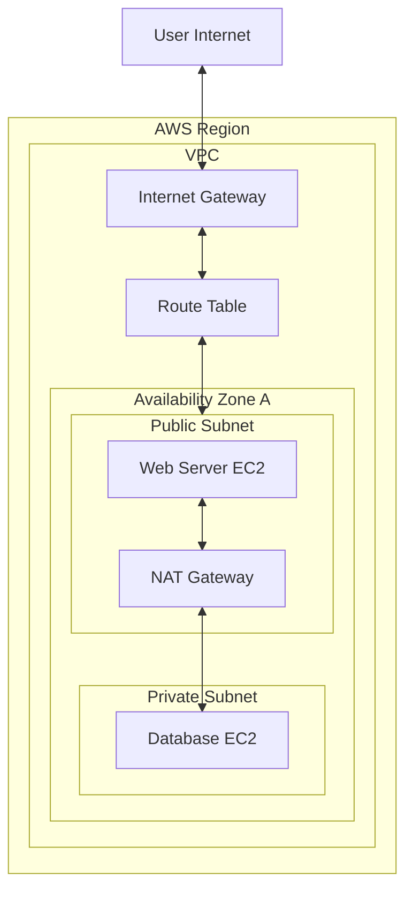

# AWS (Amazon Web Services): Comprehensive Theory Study Guide

---

## Module 1: Cloud Computing Basics

*   **What is Cloud Computing?**
    Cloud computing is the on-demand delivery of IT resources (compute, database, storage, networking) over the internet with pay-as-you-go pricing. It eliminates the need to buy, own, and maintain physical data centers.
*   **Deployment Models**
    *   **Public Cloud**: Owned and operated by third-party cloud providers (e.g., AWS, Azure). Resources are shared with other tenants over the public internet.
    *   **Private Cloud**: Cloud infrastructure used exclusively by a single organization. Can be hosted on-premises or by a third-party host.
    *   **Hybrid Cloud**: Integrates public cloud services with private clouds or on-premises infrastructure, allowing data and applications to be shared between them.
    *   **Multi-Cloud**: Utilizing cloud services from multiple public cloud providers (e.g. AWS *and* Google Cloud) to prevent vendor lock-in or leverage specific service features.
*   **Advantages of Cloud Computing**
    *   **Variable Expense**: Trade capital expense (buying hardware) for operational variable expense.
    *   **Massive Economies of Scale**: Lower prices due to high-volume aggregate usage.
    *   **Stop Guessing Capacity**: Automatically scale resources up or down dynamically.
    *   **Agility & Speed**: Provision resources in seconds rather than waiting months for server deliveries.
    *   **Focus on Business**: Stop spending money and time maintaining physical server racks.
    *   **Go Global in Minutes**: Deploy applications across multiple geographic regions with a few clicks.
*   **Disadvantages of Cloud Computing**
    *   Downtime risks due to provider network failures.
    *   Limited control over low-level hardware configurations.
    *   Complexity in managing configurations, which can lead to billing surprises.
    *   Data transfer bottlenecks when moving massive datasets out of the cloud.
*   **Service Models**
    *   **IaaS (Infrastructure as a Service)**: Provides raw computing infrastructure (virtual machines, storage, networks). Customer manages OS, runtime, and applications. (e.g., Amazon EC2).
    *   **PaaS (Platform as a Service)**: Provides a managed platform. AWS handles the OS, middleware, and database patching; the customer only deploys application code. (e.g., AWS Elastic Beanstalk).
    *   **SaaS (Software as a Service)**: A fully completed software application hosted and managed entirely by the provider. (e.g., Salesforce, Microsoft 365).
*   **Serverless Computing**: A cloud execution model where developers write code and the cloud provider handles provisioning, scaling, patching, and resource allocation. Charging is based on active execution millisecond times.
*   **Edge Computing**: Deploying compute resources closer to the source of data generation (end-user devices) rather than routing all queries to centralized cloud datacenters, reducing latency.

---

## Module 2: AWS Basics

*   **What is AWS?**
    Amazon Web Services is a secure, highly scalable cloud computing platform offering over 200 fully featured services from data centers globally.
*   **AWS Global Infrastructure**
    *   **AWS Regions**: Geographic locations consisting of multiple, isolated, and physically separate Availability Zones.
    *   **Availability Zones (AZs)**: One or more discrete data centers with redundant power, networking, and connectivity in an AWS Region.
    *   **Edge Locations**: CDN cache endpoints used by Amazon CloudFront to deliver static content with low latency to nearby users.
*   **AWS Pricing Models**
    *   **On-Demand**: Pay-per-second or hour with no upfront commitment.
    *   **Savings Plans / Reserved Instances**: Commit to a consistent amount of usage (1- or 3-year term) in exchange for up to a 72% discount.
    *   **Spot Instances**: Bid on spare AWS compute capacity for up to a 90% discount. AWS can reclaim instances with a 2-minute warning. Best for stateless, batch jobs.
*   **AWS Free Tier**: Provides newly registered accounts with 12 months of free access to specific services within set usage limits (e.g., 750 hours of t2.micro EC2 monthly).

---

## Module 3: EC2 (Elastic Compute Cloud)

*   **What is EC2?**
    Elastic Compute Cloud provides secure, resizable virtual servers (instances) in the AWS cloud.
*   **EC2 Instance Types**
    Categorized by optimization profiles: General Purpose (T/M series), Compute Optimized (C series), Memory Optimized (R/X series), Storage Optimized (I/D series), and Accelerated Computing (G/P GPU series).
*   **Dedicated Hosts**: A physical EC2 server fully dedicated to your single use, allowing compliance with specific software licensing rules (BYOL).
*   **AMI (Amazon Machine Image)**: A preconfigured template containing the OS, software configurations, and volume structures needed to launch new EC2 instances.
*   **Security Groups**
    Virtual firewalls acting at the **instance level** to control inbound and outbound traffic.
    > [!IMPORTANT]
    > Security Groups are **stateful**. If you allow inbound traffic from an IP, outbound response traffic is automatically allowed, regardless of outbound rules.
*   **Key Pair**: A public and private cryptographic key pair used to securely authenticate SSH access to EC2 instances.
*   **Elastic IP**: A static, public IPv4 address that can be dynamically remapped between EC2 instances to mask server failures.
*   **User Data**: A bootstrap shell script passed during configuration that runs automatically on the instance's very first boot (used for updates, package installs).
*   **Placement Groups**
    *   *Cluster*: Places instances in a single rack in one AZ. Low-latency networking.
    *   *Spread*: Places instances on physically separate hardware racks across AZs, minimizing core failures.
    *   *Partition*: Divides instances into logical partition groups that do not share hardware with other partitions.

---

## Module 4: Storage

*   **Amazon S3 (Simple Storage Service)**
    Object storage offering high durability ($99.999999999\%$ - eleven 9s) and scalability. Files are stored as key-value pairs inside **Buckets**.
    *   **S3 Storage Classes**:
        *   *S3 Standard*: High durability, availability, and low latency for active data.
        *   *S3 Intelligent-Tiering*: Automatically shifts files between access tiers to optimize costs based on usage patterns.
        *   *S3 Standard-IA (Infrequent Access)*: Cheaper storage but charges retrieval fees. For data accessed less than once a month.
        *   *S3 Glacier (Flexible/Deep Archive)*: Low-cost archival storage. Retrieval times range from minutes (Glacier) to 12 hours (Deep Archive).
    *   **Versioning**: Retains multiple versions of an object in a bucket, protecting against accidental deletions or overwrites.
    *   **Lifecycle Policies**: Automatically shifts objects to cheaper storage classes or deletes them after a specified number of days.
    *   **Cross-Region Replication (CRR)**: Automatically replicates objects from a source bucket to a target bucket in a different AWS region for disaster recovery.
    *   **S3 Encryption**: Supports Server-Side Encryption (SSE-S3, SSE-KMS, or client-side managed keys).
*   **EBS (Elastic Block Store)**
    Network block storage volumes attached to EC2 instances. Acts as a raw hard drive. Data is persistent and locked to a single AZ.
*   **EFS (Elastic File System)**
    A serverless, shared network file system (NFS) that can be mounted simultaneously by hundreds of EC2 instances across multiple Availability Zones.
*   **FSx**: Fully managed third-party file systems (e.g., FSx for Lustre for high-performance computing, FSx for Windows File Server).
*   **Storage Gateway**: Connects on-premises environments to cloud storage (S3) for hybrid cloud architectures.
*   **Comparisons**
    *   *EBS vs EFS*: EBS can only be attached to a single EC2 instance at a time in one AZ. EFS can be mounted by hundreds of instances simultaneously across multiple AZs.
    *   *EBS vs S3*: EBS is block storage for high-frequency database read/writes. S3 is object storage accessible via HTTP APIs.

---

## Module 5: IAM (Identity and Access Management)

IAM is a global service used to securely control access to AWS resources.

*   **Core Components**
    *   **IAM User**: A physical person or application identifier.
    *   **IAM Group**: A collection of users sharing matching permission privileges.
    *   **IAM Role**: An identity assumed by AWS services or users for temporary access. Uses security token services (STS) to generate short-lived credentials.
    *   **IAM Policy**: A JSON document defining permissions (Allows or Denies on Action, Effect, Resource).
*   **Managed vs. Inline Policies**
    *   *Managed Policies*: Reusable standalone JSON policies managed by AWS or created by customers that can be attached to multiple users, groups, or roles.
    *   *Inline Policies*: Hardcoded policies embedded directly inside a single user or role.
*   **Least Privilege Principle**: The security practice of granting users and roles only the minimum permissions necessary to perform their tasks.
*   **MFA (Multi-Factor Authentication)**: Recommends adding an extra layer of authentication security alongside standard credentials (username/password).
*   **Temporary Credentials**: IAM roles generate temporary security tokens (STS) that expire automatically, eliminating the need to rotate long-lived credentials.

---

## Module 6: Networking

### 1. VPC Architecture Diagram
A Virtual Private Cloud (VPC) provides isolated network environments in the cloud:

### 2. Networking Concepts
*   **VPC (Virtual Private Cloud)**: An isolated virtual network within the AWS cloud where you define subnets, route tables, and gateways.
*   **Subnets**
    *   **Public Subnet**: A subnet containing a route in its Route Table pointing to an Internet Gateway (IGW), allowing bidirectional traffic with the public internet.
    *   **Private Subnet**: A subnet isolated from the public internet. Contains no route to the IGW.
*   **CIDR (Classless Inter-Domain Routing)**: IP address allocation notation (e.g., `10.0.0.0/16` defines a network range of 65,536 IPs).
*   **Internet Gateway (IGW)**: A VPC component that enables communication between resources in your public subnets and the internet.
*   **NAT Gateway (Network Address Translation)**: A managed gateway placed in a public subnet that allows resources in private subnets to send outbound traffic to the internet, but prevents the public internet from establishing inbound connections.
*   **Security Groups vs. Network ACLs**
    *   **Security Groups**: Stateful, acting at the **instance level**. Evaluates all rules before allowing traffic.
    *   **Network ACLs (NACL)**: Stateless (requires explicit rules for both inbound and outbound traffic), acting at the **subnet level**. Evaluates rules sequentially by number.
*   **Elastic Network Interface (ENI)**: A virtual network card that can be attached to EC2 instances.

---

## Module 7: Load Balancing

*   **What is ELB (Elastic Load Balancing)?**
    A service that automatically distributes incoming application traffic across multiple targets (EC2 instances, containers, Lambdas) in one or more Availability Zones.
*   **Load Balancer Types**
    *   **ALB (Application Load Balancer)**: Layer 7 (HTTP/HTTPS) load balancer. Supports path-based (`/api`) and host-based (`app.domain.com`) routing.
    *   **NLB (Network Load Balancer)**: Layer 4 (TCP/UDP) load balancer. Designed for ultra-high throughput and low latency. Can handle millions of requests per second and uses a static IP.
    *   **Gateway Load Balancer**: Layer 3 load balancer. Used to deploy, scale, and manage virtual third-party appliances (e.g., firewalls, IDS/IPS).
*   **Health Checks**: Periodic requests sent by the load balancer to target instances. Traffic is routed only to targets that pass health checks.

---

## Module 8: Auto Scaling

*   **What is Auto Scaling?**
    A service that monitors your applications and automatically adjusts compute capacity up or down to maintain steady, predictable performance at the lowest possible cost.
*   **Auto Scaling Group (ASG)**
    A collection of EC2 instances treated as a logical grouping for scaling and management purposes. You define the Minimum, Maximum, and Desired capacity.
*   **Scaling Policies**
    *   **Target Tracking**: Scale resources automatically to keep a metric at a set value (e.g., keep average CPU usage at 60%).
    *   **Scheduled Scaling**: Adjusts instance counts at specific times (e.g. scale up before peak business hours).
    *   **Dynamic Scaling**: Scale in response to custom CloudWatch alarms (e.g. scale up when SQS queue length grows).

---

## Module 9: Monitoring

*   **Amazon CloudWatch**
    A monitoring and observability service that collects metrics, monitors logs, and triggers actions based on alarms (e.g. triggering an Auto Scaling action when CPU usage is high).
*   **Amazon CloudTrail**
    Audits API calls and user activity across the entire AWS account. Logs *who* made a request, *what* action was taken, *when*, and from *where*. Essential for security auditing.
*   **AWS Config**: Tracks configurations and relationships of AWS resources over time, auditing them against compliance rules.

---

## Module 10: Databases

*   **Amazon RDS (Relational Database Service)**: Managed relational databases (PostgreSQL, MySQL, SQL Server, Oracle). Handles automated backups, OS patching, and Multi-AZ replication.
*   **Amazon Aurora**: A cloud-native, relational database engine (MySQL and PostgreSQL compatible). It is up to 5x faster than standard MySQL, replicates 6 copies of data across 3 AZs automatically, and features self-healing storage.
*   **Amazon DynamoDB**: A fully managed, serverless NoSQL database. Delivers single-digit millisecond latency at any scale. Uses partition keys and sort keys for fast retrieval.
*   **Amazon Redshift**: Columnar data warehouse designed for high-performance OLAP queries on large datasets.
*   **Amazon ElastiCache**: Managed in-memory caching service supporting Redis and Memcached to accelerate application response times.
*   **RDS vs. DynamoDB**
    RDS is structured relational (SQL) for transactional applications requiring ACID joins. DynamoDB is serverless NoSQL for key-value structures that need to scale horizontally with consistent millisecond latencies.

---

## Module 11: Serverless Compute

*   **AWS Lambda**
    An event-driven serverless compute service that executes code in response to triggers. Max execution limit is **15 minutes**.
*   **Lambda Layers**: A mechanism to package common libraries, dependencies, or custom runtimes, making them shareable across multiple Lambda functions to reduce deployment package sizes.
*   **Lambda Triggers**: Events that invoke a Lambda function (e.g., S3 object uploads, DynamoDB streams, API Gateway requests, SQS messages).
*   **API Gateway**: A managed service that allows developers to create, secure, and publish REST/HTTP APIs. Often acts as the entry gate to trigger backend Lambda functions.
*   **Step Functions**: A serverless orchestrator that coordinates multiple Lambda functions and AWS services into workflows using state machines.

---

## Module 12: Messaging

*   **Amazon SQS (Simple Queue Service)**
    A fully managed, pull-based message queuing service used to decouple application components.
    *   *Standard Queue*: Unlimited throughput, guarantees at-least-once delivery, but messages can occasionally arrive out of order.
    *   *FIFO Queue*: Guarantees first-in-first-out order and exactly-once processing, but capped at 300 transactions/second (3,000 with batching).
*   **Amazon SNS (Simple Notification Service)**
    A fully managed, push-based pub/sub messaging service. Fan-out architecture sends messages to multiple subscribers (SQS, Lambda, Email) simultaneously.
*   **SQS vs. SNS**
    SQS is a queue where one consumer pulls and processes a message. SNS is a pub/sub topic that pushes messages to multiple subscribers simultaneously.
*   **Dead Letter Queue (DLQ)**: A secondary queue where messages that fail processing multiple times are automatically sent for inspection and debugging.

---

## Module 13: Containers

*   **Docker on AWS**: Standard packaging for containerized applications.
*   **ECS (Elastic Container Service)**: AWS-native container orchestration service. Very simple and integrates natively with other AWS services.
*   **EKS (Elastic Kubernetes Service)**: Managed Kubernetes service, providing standard Kubernetes APIs to deploy and manage containerized applications.
*   **Fargate**: A serverless compute engine for containers. Works with both ECS and EKS, eliminating the need to manage EC2 instances for container execution.

---

## Module 14: Data Engineering Services

*   **AWS Glue**: Serverless data integration (ETL) service.
*   **Glue Crawlers**: Scans data in S3 to infer schemas and write tables to the **Glue Data Catalog**.
*   **Athena**: Serverless query service that runs standard SQL queries directly on S3 files.
*   **EMR**: Managed Hadoop/Spark cluster platform for running large-scale data transformations.
*   **Kinesis**: Managed real-time data streaming service (equivalent to Kafka).

---

## Module 15: Security Services

*   **KMS (Key Management Service)**: Managed service used to create, control, and rotate cryptographic keys for data encryption.
*   **Secrets Manager vs. Parameter Store**
    *   **Secrets Manager**: Stores database credentials and API keys. Supports automatic rotation and integration with KMS.
    *   **Parameter Store**: Hierarchical storage for configuration data (strings, passwords). Free tier available; does not support automated rotation.
*   **WAF (Web Application Firewall)**: Protects web applications against SQL injections, cross-site scripting (XSS), and common web exploits.
*   **Shield**: DDoS protection service. Standard is free; Advanced offers dedicated DDoS response team support.
*   **Cognito**: User directories and access control for web and mobile applications.

---

## Module 16: DevOps

*   **CodePipeline**: Orchestrates CI/CD workflows from source code to deployment.
*   **CodeBuild**: Serverless build and testing service.
*   **CodeDeploy**: Automates deployment tasks to EC2, Fargate, or on-premises servers.
*   **CloudFormation**: Infrastructure as Code (IaC) service that provisions AWS resource stacks using declarative YAML or JSON templates.
*   **Elastic Beanstalk**: Platform as a Service (PaaS). Automates capacity provisioning, load balancing, and scaling; developers only deploy code.

---

## Module 17: AI & ML Services

*   **Amazon SageMaker**: A comprehensive platform to build, train, tune, and deploy machine learning models. Provides hosted endpoints for real-time model inference.
*   **AI Application Services**
    *   *Textract*: Automatically extracts text and tabular data from documents.
    *   *Rekognition*: Image and video analysis (object and face detection).
    *   *Comprehend*: NLP service that extracts insights and sentiments from text.
    *   *Lex*: Conversational AI for building voice and text chatbots.

---

## Module 18: GenAI on AWS

*   **Amazon Bedrock**
    A fully managed serverless service that offers access to leading Foundation Models (FMs)—such as Anthropic Claude, Meta LLaMA, Mistral, and Amazon Titan—through a single unified API.
*   **Knowledge Bases**: Managed RAG workflows in Bedrock. Automatically manages document indexing, chunking, embedding generation, and vector database updates in OpenSearch Serverless.
*   **Bedrock vs. SageMaker**
    Bedrock is a serverless API for pre-trained foundation models. SageMaker is used to build, train, and host custom machine learning models from scratch.

---

## Module 19: High Availability & DR

*   **Multi-AZ**: Synchronous replication to a standby database or server in a different AZ, enabling automated failover in case of a datacenter outage.
*   **Multi-Region**: Replicating architectures across separate geographic regions for disaster recovery and low-latency global user access.
*   **RPO vs. RTO**
    *   **RPO (Recovery Point Objective)**: The maximum amount of data loss an organization can tolerate, measured in time (e.g. maximum 1 hour of lost transactions).
    *   **RTO (Recovery Time Objective)**: The maximum allowable downtime before systems must be restored after an outage.

---

## Module 20: Performance Optimization

*   **CloudFront**: Content Delivery Network (CDN) that caches web content at globally distributed Edge Locations to reduce latency.
*   **Route53**: Domain Name System (DNS) web service. Supports routing policies such as latency-based, geolocation, failover, and weighted routing.
*   **Cost Optimization**: Implementing S3 Lifecycle policies to archieve old files, using Spot instances for batch processing, purchasing Savings Plans, and right-sizing EC2 instances.

---

## Module 21: Scenario-Based Questions

### 1. How would you deploy a FastAPI application on AWS?
Package the FastAPI application as a Docker image. Push the image to **Amazon ECR**. Create an **ECS Fargate** task definition. Deploy it behind an **Application Load Balancer (ALB)** to distribute traffic and auto-scale containers based on request count.

### 2. How would you host a RAG application?
Store document PDFs in **S3**. Set up **Amazon Bedrock Knowledge Bases** to load the documents, chunk them, embed them, and index them into an **Amazon OpenSearch Serverless** vector index. Query models like Anthropic Claude via the Bedrock API.

### 3. How would you secure an AWS application?
Isolate resources in a **VPC**. Place databases in **private subnets**. Configure **Security Groups** to restrict access to instances. Store database credentials in **Secrets Manager**, and enable **WAF** on the load balancer to protect against web exploits.

---

## Module 22: Architecture & Best Practices

### 1. AWS Well-Architected Framework
Provides design principles and architectural guidelines across 6 pillars:
1.  **Operational Excellence**: Automating changes, monitoring health, and continuously improving procedures.
2.  **Security**: Protecting data, systems, and assets using IAM, encryption, and network isolation.
3.  **Reliability**: Designing workloads to recover from infrastructure failures automatically (horizontal scaling, fault tolerance).
4.  **Performance Efficiency**: Right-sizing resources and selecting optimized storage/compute options.
5.  **Cost Optimization**: Eliminating unneeded resources and utilizing compute savings models (Spot, Savings Plans).
6.  **Sustainability**: Minimizing environmental impacts and maximizing utilization.
*   **Shared Responsibility Model**
    *   **AWS**: Security *of* the cloud (global infrastructure, physical data centers, host OS hypervisors).
    *   **Customer**: Security *in* the cloud (guest OS patching, firewall settings, data encryption, IAM policies).

---

## ⭐ Top 40 Most Frequently Asked AWS Questions (Accenture)

1.  **What is AWS?**
    Amazon Web Services: A secure cloud computing platform offering over 200 fully featured services globally.
2.  **IaaS vs PaaS vs SaaS?**
    *   IaaS: Infrastructure (virtual machines, networks). User manages OS.
    *   PaaS: Managed platforms (OS and database managed by provider). User deploys code.
    *   SaaS: Fully completed hosted software apps.
3.  **Regions vs Availability Zones?**
    A Region is a separate geographic area containing multiple AZs. An AZ consists of one or more physically isolated datacenters.
4.  **Describe S3 Storage Classes.**
    Standard (active access), Standard-IA (infrequent access), Intelligent-Tiering (auto-shifts based on use), and Glacier (archive).
5.  **EBS vs EFS vs S3?**
    *   EBS: Network block storage attached to a single EC2 in one AZ.
    *   EFS: Shared network file system mountable by multiple instances.
    *   S3: HTTP-based scalable object storage.
6.  **What is a VPC?**
    Virtual Private Cloud: An isolated virtual network inside your AWS account.
7.  **Public vs Private Subnet?**
    Public subnets contain a route pointing to an Internet Gateway. Private subnets do not, isolating them from public internet access.
8.  **Security Group vs NACL?**
    Security groups are stateful and act at the instance level. NACLs are stateless, processed sequentially, and act at the subnet level.
9.  **Internet Gateway vs NAT Gateway?**
    An IGW enables public subnet resources to communicate with the internet. A NAT Gateway allows private subnet resources to reach the internet without exposing them to inbound connections.
10. **What is AWS Lambda?**
    A serverless compute service that executes code in response to triggers, with a 15-minute maximum run limit.
11. **Lambda vs EC2?**
    Lambda is serverless, auto-scales instantly, and is priced per millisecond of execution. EC2 provides virtual servers where you manage the OS, paying for the uptime of the server.
12. **What is API Gateway?**
    A serverless service that allows you to create, secure, and publish REST/HTTP APIs.
13. **Explain Auto Scaling.**
    Dynamically adjusts EC2 instance counts inside an Auto Scaling Group to match application load.
14. **What is an Application Load Balancer (ALB)?**
    A Layer 7 load balancer that routes traffic to targets based on path or host headers.
15. **CloudWatch vs CloudTrail?**
    CloudWatch monitors metrics, logs, and triggers system alarms. CloudTrail audits API calls and user activities across the AWS account.
16. **RDS vs DynamoDB?**
    RDS is structured relational SQL. DynamoDB is managed serverless key-value NoSQL offering consistent millisecond latencies.
17. **What is Amazon Redshift?**
    A petabyte-scale columnar data warehouse optimized for OLAP.
18. **AWS Glue vs Athena?**
    Glue is an ETL integration service containing crawler and Spark engines. Athena is a serverless query service running SQL queries on S3 files.
19. **SQS vs SNS?**
    SQS is a pull-based queue for one consumer. SNS is a push-based pub/sub topic for fan-out messages to multiple subscribers.
20. **What is Fargate?**
    A serverless compute engine for containers that eliminates the need to manage EC2 instances for ECS or EKS.
21. **What is AWS KMS?**
    Key Management Service: A service used to create, rotate, and manage cryptographic keys.
22. **Secrets Manager vs Parameter Store?**
    Secrets Manager handles credentials, integrates with KMS, and supports automatic rotation. Parameter Store is a configuration store without auto-rotation.
23. **What is Amazon Bedrock?**
    A fully managed serverless service offering API access to leading foundation models.
24. **Multi-AZ vs Multi-Region?**
    Multi-AZ provides datacenter redundancy and failover in the same region. Multi-Region provides disaster recovery and low-latency global user routing.
25. **What is the Well-Architected Framework?**
    A set of design principles across 6 pillars: Operational Excellence, Security, Reliability, Performance Efficiency, Cost Optimization, and Sustainability.
26. **Explain the Shared Responsibility Model.**
    AWS is responsible for security *of* the cloud. The customer is responsible for security *in* the cloud (data, configurations, IAM).
27. **What is CloudFormation?**
    An IaC service that provisions resource stacks using YAML/JSON templates.
28. **What is AWS Glue Data Catalog?**
    A Hive-compliant metadata repository for structured tables stored on S3.
29. **What is Amazon EMR?**
    A managed platform for running big data frameworks like Apache Spark and Hadoop.
30. **Explain Blue-Green Deployment.**
    Creating two identical environments: Blue (active production) and Green (new release). Traffic is swapped to Green when verified, reducing risk.
31. **What is Amazon Route53?**
    A highly available, scalable Domain Name System (DNS) web service.
32. **What is AWS Shield?**
    A managed DDoS protection service. Standard is free; Advanced offers dedicated DDoS response team support.
33. **What is AWS Config?**
    A service that records resource configurations, auditing compliance rules.
34. **What is Amazon Cognito?**
    A service that provides sign-up, sign-in, and access control for web and mobile applications.
35. **What are S3 Lifecycle Policies?**
    Automated rules that transition objects to cheaper storage classes or delete them after a set period.
36. **Explain Elastic IP.**
    A static public IPv4 address that can be remapped dynamically between instances to mask failures.
37. **What is a Dead Letter Queue (DLQ)?**
    A queue where messages that fail processing multiple times are sent for debugging.
38. **What is Kinesis?**
    A managed real-time data streaming service.
39. **What is AWS Organizations?**
    A service that allows you to consolidate and manage multiple AWS accounts centrally.
40. **End-to-End ML Architecture on AWS**
    1.  Data stored in **S3**.
    2.  ETL performed using **AWS Glue** or **EMR** to register tables in the **Glue Data Catalog**.
    3.  Model built, trained, and tuned in **Amazon SageMaker**.
    4.  Model hosted as a SageMaker real-time endpoint.
    5.  fastAPI app on **ECS Fargate** routes user requests to SageMaker endpoint.
    6.  Monitored with **CloudWatch** and audited with **CloudTrail**.
